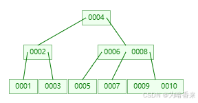
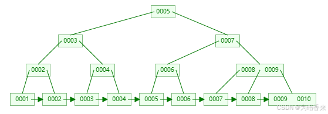

# 基本概念
+ 通过某种算法，构建数据模型，用于提高数据库查询的效率

+ ***索引的原理***：
  ***哈希（hash）索引***
  索引值x--->f(x)--->地址
  哈希冲突：多个索引值对应一个地址
  优点：通过字段值计算hash值，定位数据速度快
  缺点：不能使用范围查询
  ***二叉树***
  左子树小于根节点，右子树大于根节点
  缺点：可能产生不平衡，形成向右的斜线，类似链表结构
  ***平衡二叉树***
  特点：与二叉树相比，左右子树的深度之差不超过1
  缺点：插入数据时需要旋转，范围查询时需要回旋，效率低
  ***B+TREE索引***
  特点：所有数据都存储在叶子节点，使用双向链表存放，非叶子节点不存储数据，当范围查找时很方便

下面两幅图分别为B-TREE和B+TREE


**MyISAM引擎**叶节点存放的是数据地址
**InnoDB引擎**叶节点存放的是数据，效率高于MyISAM，但需要额外的磁盘空间
+ 创建索引的***原则***
  1. 更新频繁的列不设置索引
  2. 数据量小的表不设置索引
  3. 重复数据多的列（超过15%）不设置索引
  4. 先考虑对where和order by子句中经常出现的列建立索引
+ 索引的***优点***
  1. 加快数据检索速度
  2. 使用分组和排序进行数据查询时，可以减少排序和分组的时间
  3. 唯一索引，避免同一个字段出现重复的值
  4. 加速表和表之间的连接
+ 索引的***缺点***
  1. 创建索引和维护索引需要时间成本，并且随着数据量的增加而增加
  2. 索引需要占物理空间，除了数据表占用数据空间外，每一个索引还要占一定的物理空间
  3. 降低数据更新表的速度，因为索引需要动态维护

```sql
create database IF NOT EXISTS mydb_index;
use mydb_index;
```
# 单列索引
+ 一个索引只包含一个列，一个表中可以有多个单列索引
  包含普通索引、唯一索引和主键索引
## 普通索引（index）
+ 没有限制，允许在定义索引的列中插入重复值和空值
+ 创建索引

```sql
-- 创建方式1-创建表时创建
create table if not exists student(
    sid int primary key,
    card_id varchar(20),
    name varchar(20),
    gender varchar(20),
    age int,
    birth date,
    phone_num varchar(20),
    score double,
    index index_name(name) -- 给name创建普通索引
);

   select * from student where name = 'zhangsan';
-- 创建方式2-创建表后创建
   create index index_gender on student(gender);
-- 创建方式3-修改表结构
   alter table student add index index_age(age);
```
+ 查看索引

```sql
-- 查看数据库所有索引
select * from mysql.innodb_index_stats a where a.database_name = 'mydb_index';
-- 查看表所有索引
show index from student;    -- 信息较少
select * from mysql.innodb_index_stats a where a.database_name = 'mydb_index' and a.table_name like 'student';    -- B+树索引
```
+ 删除索引

```sql
drop index index_name on student;
alter table student drop index index_age;
```
## 唯一索引（unique）
+ 在普通索引的基础上，增加唯一约束，允许有空值
```sql
-- 创建方式1-创建表时创建
create table if not exists student2(
   sid int primary key,
   card_id varchar(20),
   name varchar(20),
   gender varchar(20),
   age int,
   birth date,
   phone_num varchar(20),
   score double,
   unique index_card_id(card_id) -- 给card_id创建唯一索引
);
-- 查看student2的索引
select * from mysql.innodb_index_stats a where a.database_name = 'mydb_index' and a.table_name like 'student2';
-- 创建方式2-创建表后创建
create unique index index_card_id on student2(card_id);
-- 创建方式3-修改表结构
alter table student2 add unique index_phone_num(phone_num);
```
## 主键索引
+ 在创建表时，主键列自动创建主键索引，唯一且不允许有空值
# 组合索引
+ 也叫复合索引，一个索引包含多个列，可以是普通索引也可以是唯一索引
+ 最左原则，从左往右，一个查询时只能使用组合索引中的最左列，索引列顺序无所谓
```sql
 -- 普通索引
     create index index_phone_name on student(phone_num, name);
 -- 唯一索引
     create unique index index_card_phone on student(card_id, phone_num);
```
# 全文索引（fulltext）
+ 专门用于搜索很长一篇文章时查询，基于相似度查询

```sql
/*
     适用的字段数据类型：varchar、text、char
     数据量较大时，先创建表放入数据再创建索引，相比于给全文索引的表插入数据要更快
     适用MySQL版本和引擎：MySQL5.6+，InnoDB和MyISAM、MySQL5.6-，MyISAM
     关键字：match和against
     对一个词语使用全文索引搜索，长度必须在最小搜索长度和最大搜索长度之间，查看语句为：show variables like '%ft%';
*/
```

+ 查看全文检索

```sql
show variables like '%ft%';
```
+ 创建全文索引(先创建表添加数据，再创建索引)
1. 创建适合添加全文索引的表

```sql
                create table if not exists t_artice(
                    id int primary key auto_increment,
                    title varchar(255),
                    content varchar(1000),
                    writing_date date
                );
```
2. 添加数据


```sql
 insert into t_artice values(null, 'MySQL', 'MySQL is a relational database management system', '2024-01-23');
 insert into t_artice values(null, 'Sigmoid', 'Sigmoid gives probabilistic meaning to the output of neurons', '2024-02-23');
 insert into t_artice values(null, 'GAN', 'The GAN network consists of a generator and a discriminator, which work against each other to get the generator that can generate the most realistic new sample image', '2024-03-23');
 insert into t_artice values(null, 'RNN', 'RNN network is a special kind of neural network that can learn sequence data', '2024-04-23');
 insert into t_artice values(null, 'LSTM', 'LSTM is a special type of RNN that is capable of learning long-term dependent information', '2024-05-23');
 insert into t_artice values(null, 'Transformer', 'Transformer essentially spatializes sequence data through location coding', '2024-06-23');
 insert into t_artice values(null, 'Mamba', 'Mamba is essentially an improvement of the SSM model, letting go of the assumptions of linearity and time invariance', '2024-07-23');        
```
3. 创建全文索引(两种方式)

```sql
 alter table t_artice add fulltext index_content(content);
 create fulltext index index_content on t_artice(content);
```
4. 查询（match后跟列名，against后跟查询的关键词）

```sql
select * from t_artice where match(content) against('gives');
```
# 空间索引（spatial）
+ 创建的列必须非空

```sql
/*
 对空间类型的字段建立的索引，4种空间数据类型：point、linestring、polygon和geometry
     point：点，坐标值
     linestring：线，由点连接而成
     polygon：多边形，由线组成
     geometry：几何，任何一种空间类型
*/
```

```sql
        create table if not exists shop_info(
            id int primary key auto_increment comment 'id',
            shop_name varchar(64) not null comment '店铺名称',
            geom_point geometry not null comment '店铺经纬度',
            spatial key geom_index(geom_point)
        );
```
# MySQL存储引擎
+ MySQL的存储引擎：是数据库底层软件组织，数据库管理系统使用数据引擎来存储、检索、更新和删除数据。不同存储引擎提供不同存储机制、索引技巧、锁定水平等功能。
  1. MyISAM：较高的插入、查询速度，但不支持事务处理。
  2. InnoDB：支持ACID事务、行级锁定和外键约束，具有事务安全性和崩溃修复能力。
+ 修改MySQL默认存储引擎：
  1. 在任务管理器关闭MySQL服务
  2. 修改my.ini文件中default-storage-engine=MyISAM为default-storage-engine=InnoDB
  3. 重启MySQL服务
```sql
    -- 查看存储引擎
        show engines;
    -- 查看当前默认引擎
        show variables like '%default_storage_engine%';
    -- 查看表使用的存储引擎
        show create table student;
    -- 创建表时指定存储引擎
        create table if not exists student3(id int, name varchar(20)) engine=MyISAM;
    -- 修改存储引擎
        alter table student3 engine=InnoDB;
```
