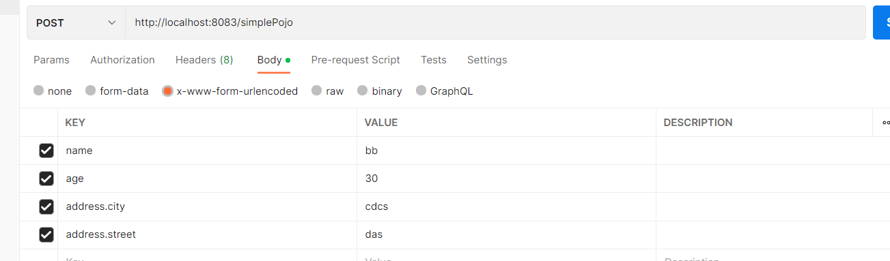

# SpringBoot-Web请求响应

****

## 一、请求


### 1. 简单参数

```java
package com.ham.controller;

import jakarta.servlet.http.HttpServletRequest;
import org.springframework.web.bind.annotation.RequestMapping;
import org.springframework.web.bind.annotation.RestController;

import java.net.http.HttpRequest;

/*
* 测试请求参数接收
* */
@RestController
public class RequestController {
    // 原始方式
//    @RequestMapping("/simpleParam")
//    public String simpleParam(HttpServletRequest request){
//        // 获取请求参数
//        String name = request.getParameter("name");
//        String ageStr = request.getParameter("age");
//        int age = Integer.parseInt(ageStr);
//        System.out.println("name:"+name+",age:"+age);
//        return "OK";
//    }

    // springboot方式
    @RequestMapping("/simpleParam")
    public String simpleParam(String name,int age){
        System.out.println("name:"+name+",age:"+age);
        return "OK";
    }

//    @RequestMapping("/simpleParam")
//    public String simpleParam(@RequestParam(name = "name", required = false) String userName, int age){
//        System.out.println("name:"+userName+",age:"+age);
//        return "OK";
//    }
}
```

1.原始方式获取请求参数

    Controller方法形参中声明HttpServletRequest对象调用对象的getParameter(参数名)

2.SpringBoot中接收简单参数
    请求参数名与方法形参变量名相同会自动进行类型转换
3.@RequestParam注解

    方法形参名称与请求参数名称不匹配，通过该注解完成映射该注解的required属性默认是true,代表请求参数必须传递。

### 2. 实体参数

将参数封装到一个类里面（请求参数名与形参对象属性名相同，即可直接通过POJO接收）

```java
package com.ham.pojo;

public class User {
    private String name;
    private int age;
}
```

```java
    // 2. 实体参数
    @RequestMapping("/simplePojo")
    public String simplePojo(User user){
        System.out.println(user);
        System.out.println(user.getName());
        System.out.println(user.getAge());
        return "OK";
    }
```

如果参数嵌套，则请求时如下：



### 3. 数组集合参数

数组参数：请求参数名与形参数组名称相同且请求参数为多个，定义数组类型形参即可接收参数

```java
    // 3. 数组集合参数
    @RequestMapping("/arrayParam")
    public String arrayParam(String[] hobby){
        System.out.println(Arrays.toString(hobby));
        return "OK";
    }
```

集合参数：清求参数名与形参集合名称相同且请求参数为多个，@RequestParam绑定参数关系

```java
    @RequestMapping("/listParam")
    public String listParam(@RequestParam List<String> hobby){
        System.out.println(hobby);
        return "OK";
    }
```

### 4. 日期参数

日期参数：使用@DateTimeFormat注解完成日期参数格式转换

```java
    @RequestMapping("/dateParam")
    public String dateParam(@DateTimeFormat(pattern = "yyyy-MM-dd HH:mm:ss") LocalDateTime updateTime){
        System.out.println(updateTime);
        return "OK";
    }
```

### 5. JSON参数

JSON参数：JSON数据键名与形参对象属性名相同，定义POJO类型形参即可接收参数，需要使用@RequestBody标识

```java
    @RequestMapping("/jsonParam")
    public String jsonParam(@RequestBody User user){
        System.out.println(user);
        return "OK";
    }
```

### 6. 路径参数

路径参数：通过请求URL直接传递参数，使用{...}来标识路径参数，需要使用@PathVariable获取路径参数

```java
    @RequestMapping("/path/{id}")
    public String pathParam(@PathVariable Integer id){
        System.out.println(id);
        return "OK";
    }

    @RequestMapping("/path/{id}/{name}")
    public String pathParam2(@PathVariable Integer id,@PathVariable String name){
        System.out.println(id + "," + name);
        return "OK";
    }
```

**** 

## 二、响应

使用@ResponseBody注解（方法注解，类注解）

位置：Controller方法/类上

作用：将方法返回值直接响应，实体对象/集合的返回类型会转为JSON

（@RestController = @Controller + @ResponseBody）

```java
@RestController
public class ResponseController {
    @RequestMapping("/getAddr")
    public Address getAddr(){
        Address address = new Address();
        address.setStreet("街道");
        address.setCity("城市");
        return address;
    }
    @RequestMapping("/listAddr")
    public List<Address> listAddr(){
        List<Address> list = new ArrayList<>();
        Address address1 = new Address();
        address1.setStreet("街道1");
        address1.setCity("城市1");
        Address address2 = new Address();
        address2.setStreet("街道2");
        address2.setCity("城市2");
        list.add(address1);
        list.add(address2);
        return list;
    }
}
```

### 统一响应结果

```java
public class Result {
    // 响应码，1代表成功，0代表失败
    private Integer code;
    // 提示信息
    private String msg;
    // 返回的数据
    private Object data;
}
```
