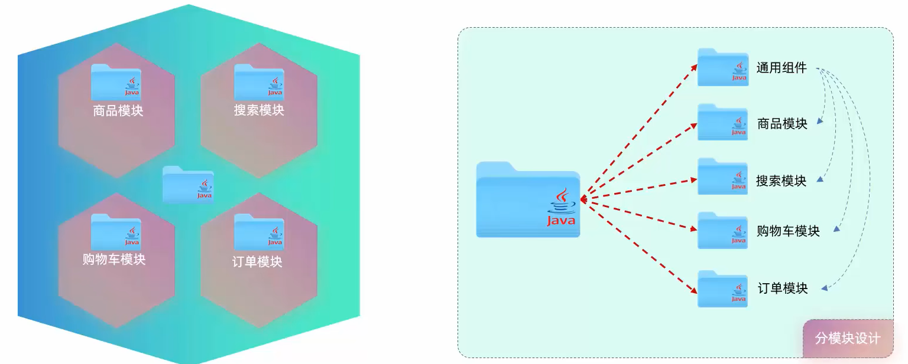
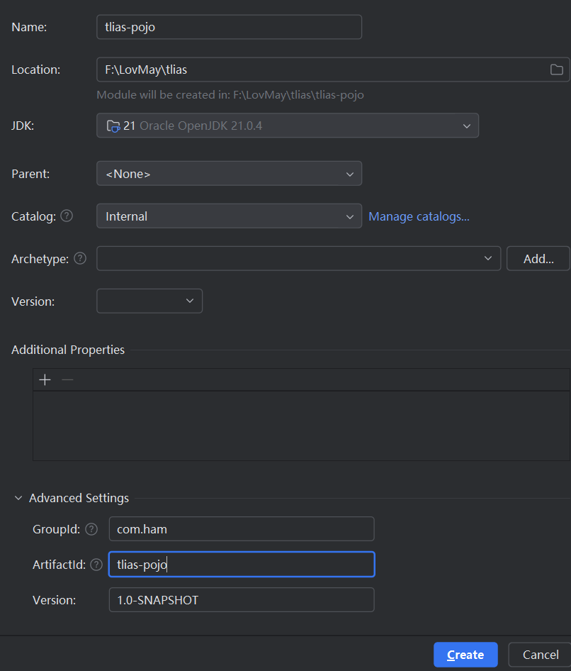
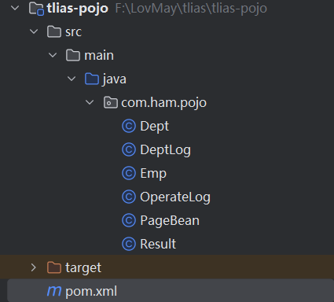
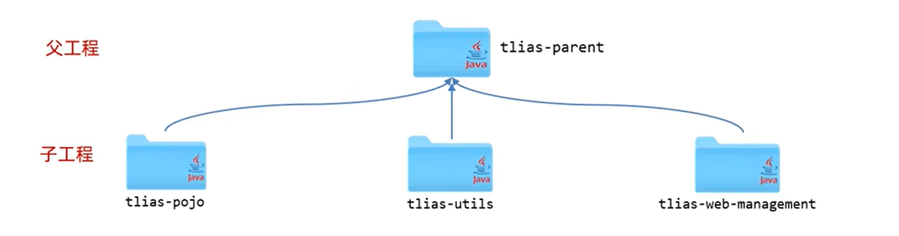
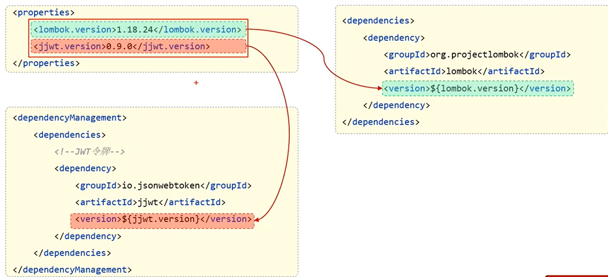
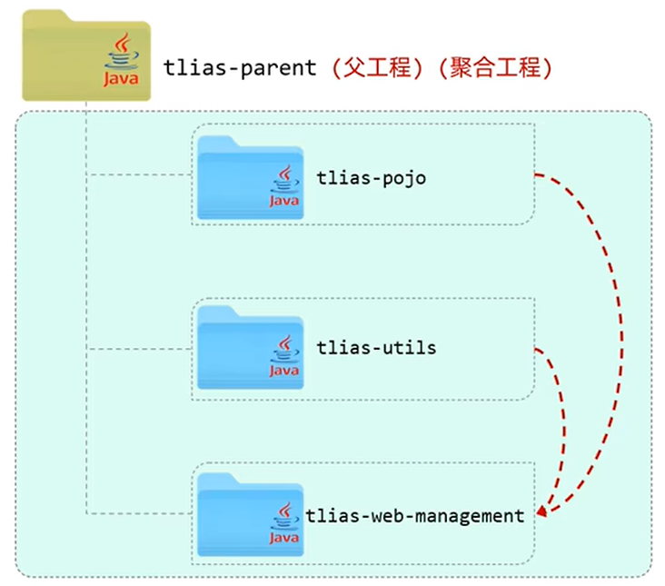
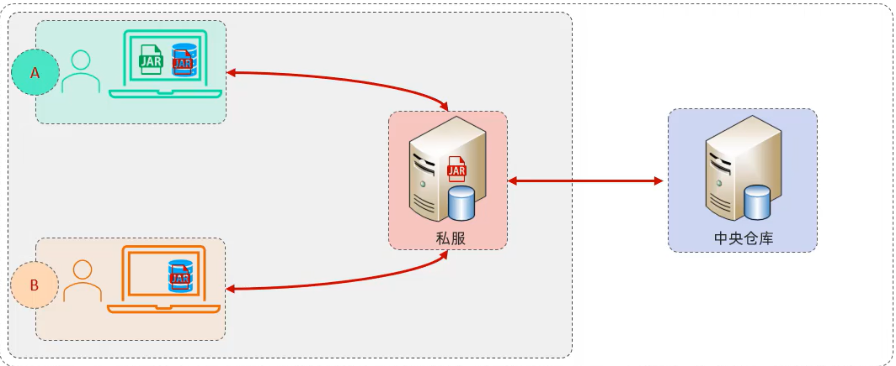

# maven高级

## 1. 分模块设计与开发

- 将项目按照功能拆分成若干个子模块，方便项目的管理维护、扩展，也方便模块间的相互调用，资源共享。



- 比如将pojo分离为单独模块出来，先创建tlias-pojo模块



- 在`com.ham`下创建pojo和所需要的实体类，并导入所需要的依赖，比如lombok



- 在使用时引入tlias-pojo依赖即可

```xml
<!--        引入pojo依赖-->
        <dependency>
            <groupId>com.ham</groupId>
            <artifactId>tlias-pojo</artifactId>
            <version>1.0-SNAPSHOT</version>
        </dependency>
```

## 2. 继承与聚合

### (1) 继承

- 继承描述的是两个工程间的关系，与java中的继承相似，子工程可以继承父工程中的配置信息，常见于依赖关系的继承。简化依赖配置，可以将公共部分的依赖定义在父工程中，子工程只需继承即可。



- java的打包方式：
  
  - jar:普通模块打包，springboot项目基本都是jar包（内嵌tomcat运行）
  
  - war(少见):普通web程序打包，需要部署在外部的tomcat服务器中运行
  
  - pom:父工程或聚合工程，该模块不写代码，仅进行依赖管理

- 继承关系实现
  
  - 创建maven:模块tlias-parent,该工程为父工程，设置打包方式pom(默认jar)，继承spring-boot-stater-parent。
  
  ```xml
      <parent>
          <groupId>org.springframework.boot</groupId>
          <artifactId>spring-boot-starter-parent</artifactId>
          <version>3.4.2</version>
          <relativePath/> <!-- lookup parent from repository -->
      </parent>
  ```
  ```xml
      <groupId>com.ham</groupId>
  ```
  ```xml
      <artifactId>tlias-parent</artifactId>
  ```
  ```xml
      <version>1.0-SNAPSHOT</version>
  ```
  ```xml
      <packaging>pom</packaging> <!-- 设置打包方式 -->
  ```
  
  - 在子工程的pom中配置继承关系，注意SpringBoot项目都继承了spring-boot-stater-parent父工程，但是不能多继承，所以只能继承传递，即将SpringBoot项目继承自定义父工程，然后父工程再继承spring-boot-stater-parent。子工程都配置如下继承，relativePath是找到父工程的pom文件相对路径
  
  ```xml
      <parent>
          <groupId>com.ham</groupId>
          <artifactId>tlias-parent</artifactId>
          <version>1.0-SNAPSHOT</version>
          <relativePath>../tlias-parent/pom.xml</relativePath>
      </parent>
  ```
  
  - 在父工程配置子工程的共有依赖

- 版本锁定
  
  - 可以在父工程的pom文件中使用`<dependencyManagement>`标签统一管理依赖版本，但它不会将依赖引入父工程，所以子工程在使用时还需要引入，只是不需要写版本号，后续需要变更版本时只需要在父工程中变更版本即可
  
  - 自定义属性：在`properties`中定义版本号标签，便于管理



### (2) 聚合

- 将多个模块组织成一个整体，同时进行项目构建。需要新创建一个聚合工程，不具有业务功能，只包含一个pom文件



- 作用：可以快速构建项目，无需根据依赖关系手动构建，只需直接在聚合工程上构建即可

- 直接将父工程作为聚合工程，在pom中导入子工程模块：

```xml
<!--    聚合模块-->
    <modules>
        <module>../tlias-pojo</module>
        <module>../tlias-utils</module>
        <module>../tlias-web-management2</module>
    </modules>
```

### (3) 关系

-  作用
  
  - 聚合用于快速构建项目
  
  - 继承用于简化依赖配置，统一管理依赖

- 相同点
  
  - 二者的pom.xml文件的打包方式均为`pom`，可以在同一pom文件中实现
  
  - 均属于设计型模块，无实际业务功能

- 不同点
  
  - 聚合是在聚合工程中配置关系，可以感知到参与聚合的模块
  
  - 继承在子模块中配置关系，父模块无法感知

## 3. 私服

- 私服是一种特殊的远程仓库，它是架设在局域网内的仓库服务，用来代理位于外部的中央仓库，用于解决团队内部的资源共享与资源同步问题。



- 依赖查找顺序：本地仓库 -> 私服 -> 中央仓库
