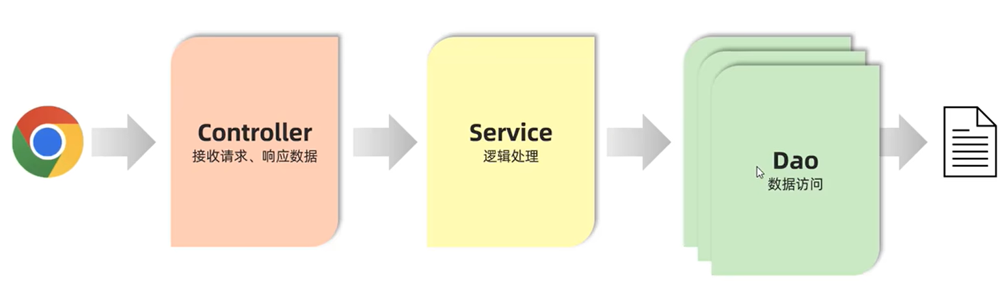

# 分层解耦

****

## 三层架构



**controller层**：控制层，接收前端发送的请求，对请求进行处理，并响应数据。

```java
@RestController
public class EmpController {
    private EmpService empService = new EmpServiceA();
    @RequestMapping("/listEmp")
    public Result list(){
        List<Emp> empList = empService.listEmp();
        return Result.success(empList);
    }
}
```

**service层**：业务逻辑层，处理具体的业务逻辑。

```java
public class EmpServiceA implements EmpService {
    private EmpDao empDao = new EmpDaoA();
    @Override
    public List<Emp> listEmp() {
        List<Emp> empList = empDao.listEmp();
        empList.stream().forEach(emp -> {
            // 获取 gender 属性
            String gender = emp.getGender();
            if ("1".equals(gender)){
                emp.setGender("男");
            } else if ("2".equals(gender)){
                emp.setGender("女");
            }

            // 获取 job 属性
            String job = emp.getJob();
            if ("1".equals(job)){
                emp.setJob("讲师");
            } else if ("2".equals(job)){
                emp.setJob("班主任");
            } else if ("3".equals(job)){
                emp.setJob("就业指导");
            }
        });
        return empList;
    }
}
```

**dao层**：数据访问层(Data Access Object)(持久层)，负责数据访问操作，包括数据的增、删、改、查。

```java
public class EmpDaoA implements EmpDao {
    @Override
    public List<Emp> listEmp() {
        String file = this.getClass().getClassLoader().getResource("emp.xml").getFile();
        System.out.println(file);
        List<Emp> empList = XmlParserUtils.parse(file, Emp.class);
        return empList;
    }
}
```

**** 

## 分层解耦

内聚：软件中各个功能模块内部的功能联系。

耦合：衡量软件中各个层/模块之间的依赖、关联程度。

设计原则：**高内聚、低耦合**。

1. 控制反转（**使用@Component注解，或者不同层分别使用@Controller、@Service、@Repository**）：Inversion Of Control，简称IOC。对象的创建控制权由程序自身转移到外部（容器）。

2. 依赖注入（**使用@Autowired注解**）：Dependency Injection，简称Dl。容器为应用程序提供运行时所依赖的资源。

        如果同类型bean存在多个

- 使用@Primary：高优先级

- 使用@Autowired + @Qualifier("bean的名称")

- 使用@Resource(name="bean的名称")（JDK提供）
3. Bean对象：IOC容器中创建、管理的对象。
