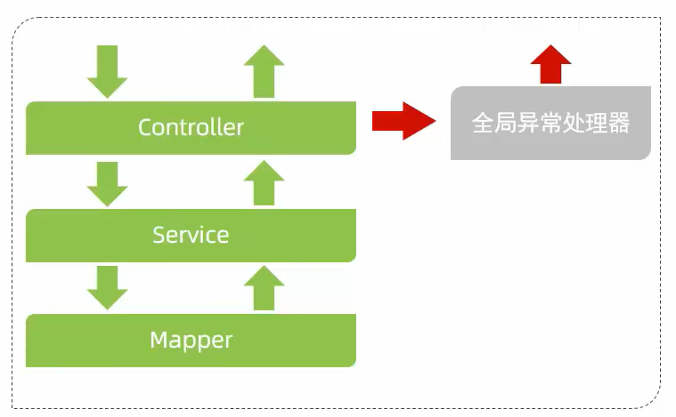

# 异常处理

- 全局异常处理器
  
  每层抛出的异常最后会被全局异常处理器捕获，封装成标准result返回，而注解`
  @RestControllerAdvice`等于`@ControllerAdvice`+`@ResponseBody`，后者可以将Result转为Json输出。



```java
/*
* 异常处理
* */
@RestControllerAdvice // 统一异常处理
public class GlobalExceptionHandler {

    @ExceptionHandler(Exception.class) // 捕获所有异常
    public Result ex(Exception ex) {
        ex.printStackTrace();
        return Result.error("对不起，操作异常");
    }
}
```
