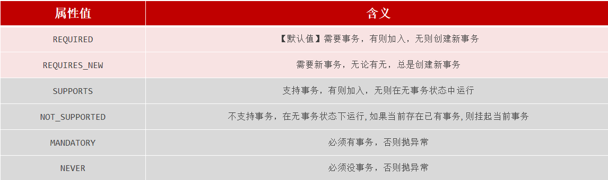
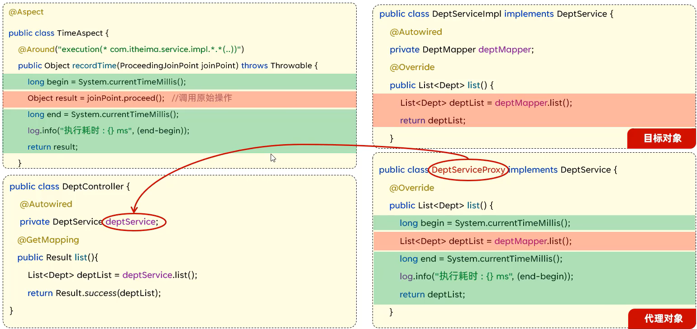

# 事务&AOP

## 1. Spring事务管理

- 注解：`@transactional`

- 位置：业务(service)层的方法、类、接口上，大多在业务层的多次增删改方法上

- 作用：将当前方法交给Spring进行事务管理，出现异常(默认只是RuntimeException)时自动进行回滚。

- yml文件配置：

```yml
# spring事务管理日志开关
logging:
  level:
    org.springframework.jdbc.support.JdbcTransactionManager: debug
```

- 删除部门及该部门员工示例：

```java
    @Transactional // 事务管理
    @Override
    public void delete(Integer id) {
        deptMapper.deleteById(id);

        int i = 1 / 0;

        empMapper.deleteByDeptId(id);
    }
```

- 使用rollbackFor参数修改为对哪些异常进行自动回滚，如对所有异常：

```java
    @Transactional(rollbackFor = Exception.class)
```

- 事务传播行为(propagation参数)：指的就是当一个事务方法被另一个事务方法调用时，这个事务方法应该如何进行事务控制。



- - REQUIRED: 大部分情况下都是用该传播行为即可。
  
  - REQUIRES NEW: 当不希望事务之间相互影响时，可以使用该传播行为。比如：下订单前需要记录日志，不论订单保存成功与否，都需要保证日志记录能够记录成功。

## 2. AOP

定义：Aspect Oriented Programming(面向切面编程、面向方面编程)，其实就是面向特定方法编程。

- 场景：
  
  - 比如案例部分功能运行较慢，定位执行耗时较长的业务方法，此时需要统计每一个业务方法的执行耗时
  
  - 记录操作日志
  
  - 权限控制
  
  - 事务管理

- 优势：
  
  - 代码无侵入
  
  - 减少重复代码
  
  - 提高开发效率
  
  - 维护方便

### 入门

- 导入依赖：

```xml
<!--        AOP-->
        <dependency>
            <groupId>org.springframework.boot</groupId>
            <artifactId>spring-boot-starter-aop</artifactId>
        </dependency>
```

- 计算业务层运行耗时代码示例：
  
  AOP要使用`@Component``@Aspect`注解，将类放入IOC容器并注明是AOP切面类，使用`@Around`注解，选择作用位置。

```java
@Slf4j
@Component
@Aspect
public class TimeAspect {

    @Around("execution(* com.ham.service.*.*(..))") // 选择应用位置，切入点表达式
    public Object recordTime(ProceedingJoinPoint joinPoint) throws Throwable {
        // 1. 记录开始时间
        long begin = System.currentTimeMillis();
        // 2. 执行原方法
        Object result = joinPoint.proceed();
        // 3. 记录结束时间, 计算耗时
        long end = System.currentTimeMillis();
        log.info("{} 耗时 {} ms", joinPoint.getSignature(), end - begin);
        return result;
    }
}
```

- 核心概念
  
  - 连接点：JoinPoint,可以被AOP控制的方法（暗含方法执行时的相关信息）
  
  - 通知：Advice,指哪些重复的逻辑，也就是共性功能（最终体现为一个方法）
  
  - 切入点：PointCut,匹配连接点的条件，通知仅会在切入点方法执行时被应用
  
  - 切面：Aspect,描述通知与切入点的对应关系（通知+切入点）
  
  - 目标对象：Target,通知所应用的对象

- 执行流程



    执行时会交给动态代理对象，然后先执行功能增强，再运行目标对象方法，最后又是功能增强。注入时实际注入的是动态代理对象。

### AOP进阶

- 通知类型
  
  - @Around：环绕通知，通知方法在目标方法前、后都被执行
  
  - @Before: 前置通知，通知方法在目标方法前被执行
  
  - @After：后置通知，通知方法在目标方法后被执行，无论是否有异常都会执行
  
  - @AfterReturning：返回后通知，通知方法在目标方法后被执行，有异常不会执行
  
  - @AfterThrowing: 异常后通知，通知方法在发生异常后执行

- 注意事项
  
  - @Around环绕通知需要自己调用ProceedingJoinPoint.proceed()来让原始方法执行，其他通知不需要考虑目标方法执行
  
  - @Around环绕通知方法的返回值，必须指定为Object,来接收原始方法的返回值。

- 抽取切入点表达式
  
  使用`@Pointcut`注解，当为public时可以在其他类引用该切入点表达式，当为private时只能在当前类引用
  
  ```java
      @Pointcut("execution(* com.ham.controller.*.*(..))")
      public void xx() {}
  
      @Around("xx()")
  ```

- 通知顺序
  
  当多个切面的切入点匹配到相同方法时，不同切面类运行顺序，默认是与切面类名顺序
  
  - 可以用`@Order`注解：目标方法前执行的通知，数字小的先执行，目标方法后执行的通知，数字大的先执行

- 切入点表达式：用来决定项目中哪些方法需要加入通知
  
  - execution(....)：根据方法的签名匹配
    
    `execution(访问修饰符 返回值 包名.类名.方法名(方法参数) throw 异常)`
    
    访问修饰符、包名.类名.、throw 异常可以省略
    
    - *：单个独立的任意符号，可以通配任意返回值、包名、类名、方法名、任意类型的一个参数，也可以通配包、类、方法名的一部分
    
    - ..：统配多个连续任意符号，可以统配任意层级的包，或任意类型和个数的参数
  
  - 用`@Annotation(....)`：匹配标识有特定注解的方法
    
    自定义注解，加到不同方法上，通过注解匹配
    
    ```java
    @Pointcut("@annotation(com.ham.aop.MyAnno)")
    ```

- 连接点
  
  在Spring中用JoinPoint抽象了连接点，用它可以获得方法执行时的相关信息，如目标类名、方法名、方法参数等。在around中只能使用ProceedingJoinPoint。

```java
@Aspect
@Slf4j
@Component
public class MyAspect {

    @Pointcut("execution(* com.ham.service.DeptService.*(..))")
    public void pt(){}

    @Before("pt()")
    public void before(JoinPoint joinPoint){
        log.info("before");
    }


    @Around("pt()")
    public Object around(ProceedingJoinPoint joinPoint) throws Throwable{
        log.info("around before");


        // 1. 获取目标方法的类名
        String className = joinPoint.getTarget().getClass().getName();
        log.info("around target class: {}", className);
        // 2. 获取目标方法的方法名
        String methodName = joinPoint.getSignature().getName();
        log.info("around target method: {}", methodName);
        // 3. 获取传入参数
        Object[] args = joinPoint.getArgs();
        log.info("around args: {}", Arrays.toString(args));
        // 4. 执行目标方法
        Object ret = joinPoint.proceed();


        log.info("around after");
        return ret;
    }
}
```

- 注意：在切面类中获取请求参数时，需要注入HttpServletRequest，然后即可得到请求头进而得到jwt令牌。
