# SpringBoot原理

## 1. 配置优先级

- 命令行参数(Program arguments) > java系统属性(VM options) > properties > yml(主流) > yaml 

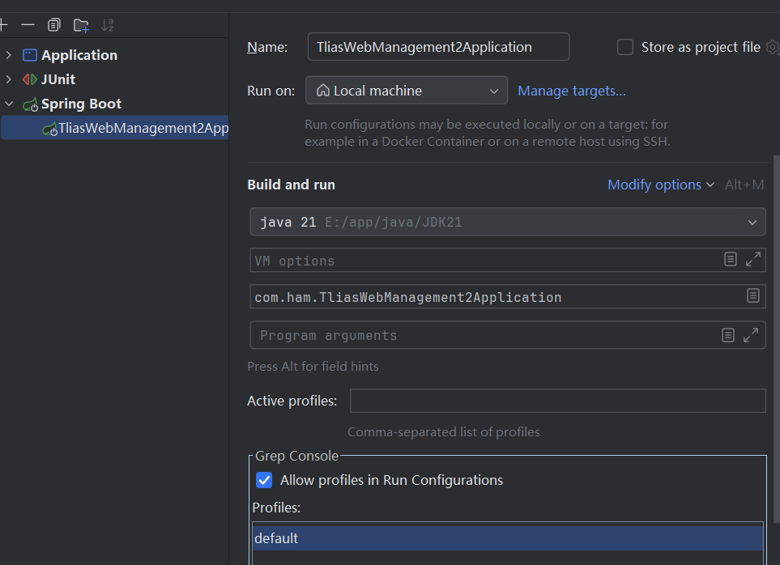

- 命令行运行jar文件：java [options] -jar < jar 文件 > [args...]，options是设置java系统属性的，args是设置命令行参数的

## 2. bean管理

- 获取bean
  
  Spring项目启动时会自动创建bean放在IOC容器中 (受到作用域及延迟初始化影响，这里主要针对于默认的单例非延迟加载的bean而言) ，可手动获取：

```java
    /*
    * 获取bean对象
    * */
    @Autowired
    private ApplicationContext applicationContext; // IOC容器对象

    @Test
    public void testGetBean(){
        // 根据bean名称获取
        DeptController bean1 = (DeptController) applicationContext.getBean("deptController");
        System.out.println("bean1 = " + bean1);
        // 根据bean类型获取
        DeptController bean2 = applicationContext.getBean(DeptController.class);
        System.out.println("bean2 = " + bean2);
        // 根据bean名称和类型获取
        DeptController bean3 = applicationContext.getBean("deptController", DeptController.class);
        System.out.println("bean3 = " + bean3);
    }
```

    单例即获取的bean123是相同的对象，有着相同的地址。

- bean的作用域

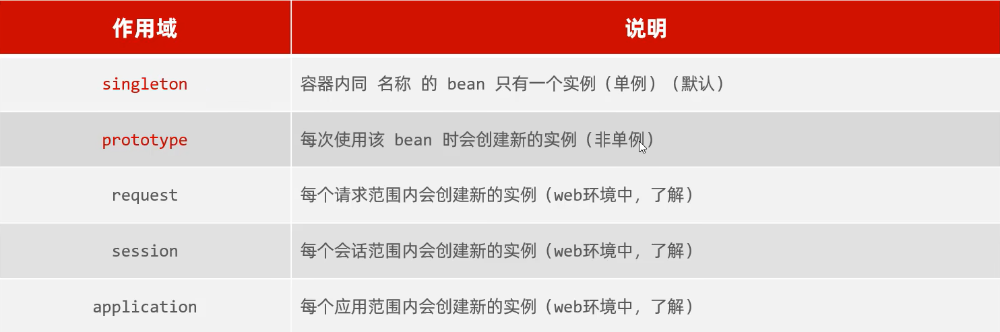

    注解`@Lazy`：可以延迟初始化到使用bean对象时才实例化，而不是在Spring项目启动时

    注解`@Scope`：设置作用域

- 第三方bean
  
  使用`@bean`注解，新建一个配置类声明第三方bean，比如dom4j的saxReader。后面使用时就可以使用`@Autowrid`注入

```java
@Configuration // 声明配置类
public class CommonConfig {
    // 声明第三方bean
    @Bean // 返回值交给IOC容器管理，成为bean对象
    public SAXReader saxReader() {
        return new SAXReader();
    }
}
```

    如果第三方bean需要依赖其它bean对象，直接在bean定义方法中设置形参即可，容器会根据类型自动装配。

## 3. SpringBoot原理

### （1）起步依赖

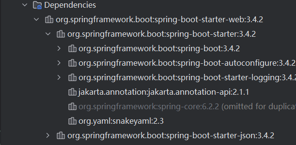

    根据maven的依赖传递，SpringBoot只需要引入一个起步依赖就可以依赖其所关联的所有依赖

### （2）自动配置

- 当Spring容器启动后，一些配置类、bean对象会自动放入IOC容器，不需要手动声明，简化了配置操作 

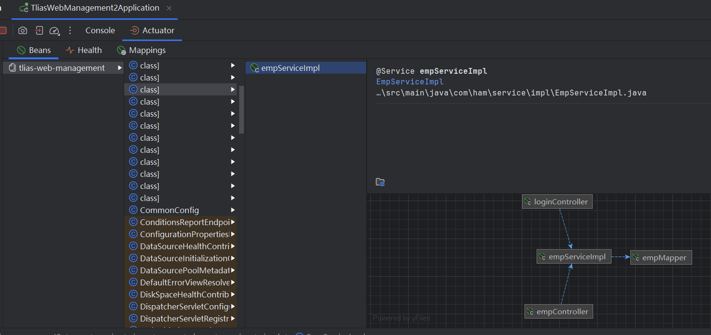

#### 加载第三方依赖的bean和配置类

- 方案一：在启动类上使用`@ComponentScan`注解来扫描不同的包，将其他包中的类放入IOC容器，这种方案使用繁琐、性能低

```java
@ComponentScan({"com.ham", "com.example"})
```

- 方案二：在启动类上使用`@Import`注解，它导入的类会被Spring加载到IOC容器中，可以导入的类有：普通类(HeaderParser)、配置类(HeaderConfig)、ImportSelector的接口实现类(MyImportSelector)

```java
@Import({HeaderParser.class, HeaderConfig.class, MyImportSelector.class})
```

- 方案三：第三方依赖提供`@Enable***`命名形式的注解，他在定义时会封装`@Import`注解将方法类导入IOC容器，所以只需加上`@Enable***`注解就好了

#### 源码跟踪

在3.4.2版本的Spring中，其自动配置原理如下：

1. 进入`@SpringBootApplication`注解

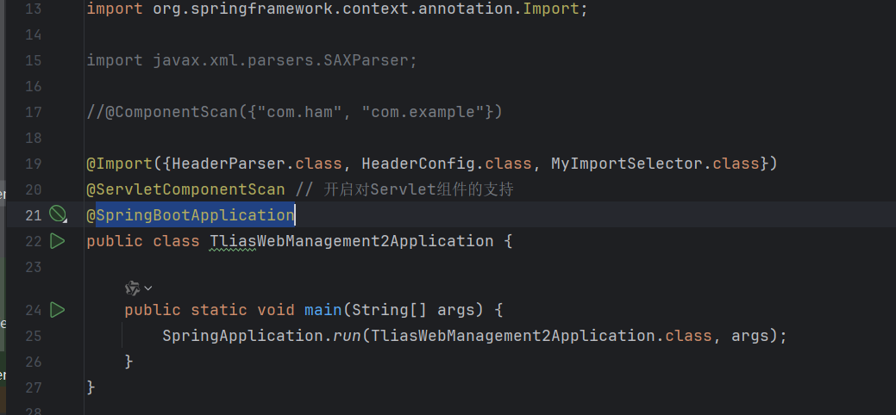

2. 可以看到引入了`@EnableAutoConfiguration`注解，进入后

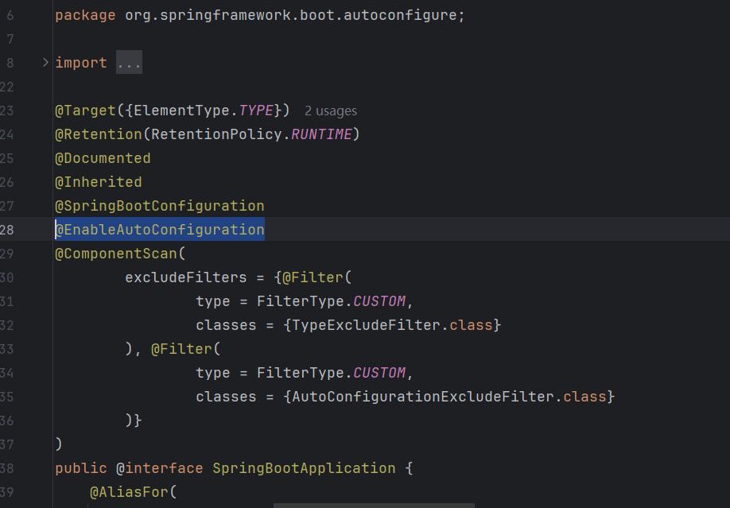

3. 可以看到它使用`@Import`注解导入了一个实现类AutoConfigurationImportSelector，进入后

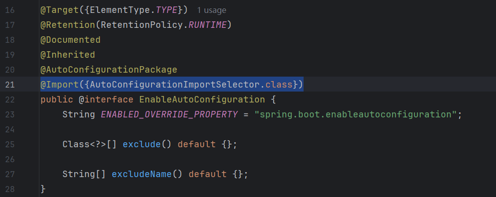

4. 可以看到它实现了DeferredImportSelector接口，进入后

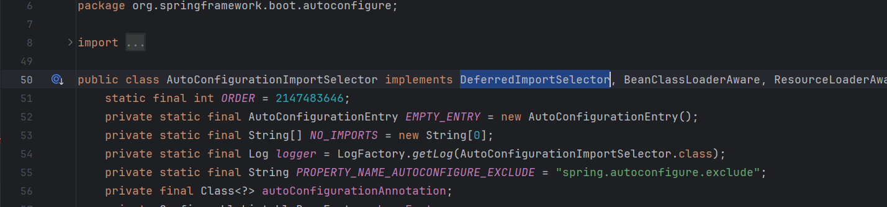

5. 可以看到它继承了ImportSelector接口，ImportSelector又声明了selectImports方法，返回的是一个String数组，DeferredImportSelector接口中也声明了selectImports方法

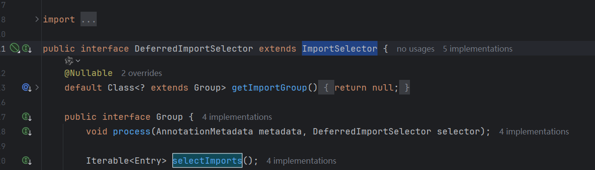

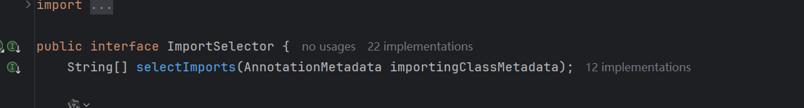

6. 再次回到AutoConfigurationImportSelector类中，可以看到它重写了selectImports方法，`isEnabled`方法用于检查当前配置是否启用，当启用时调用getAutoConfigurationEntry方法，进入后

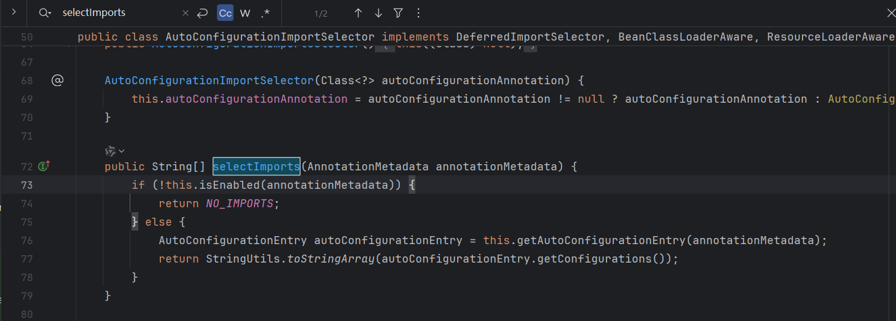

7. 当配置启用时，调用getCandidateConfigurations

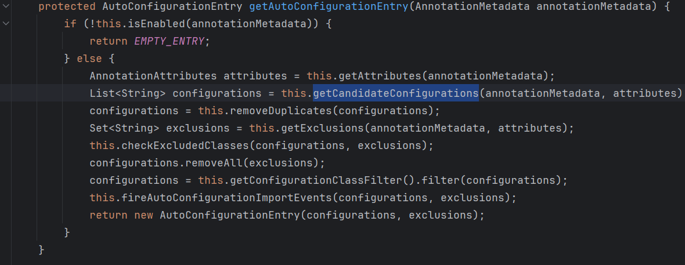

8. 进入getCandidateConfigurations方法

```java
    protected List<String> getCandidateConfigurations(AnnotationMetadata metadata, AnnotationAttributes attributes) {
        ImportCandidates importCandidates = ImportCandidates.load(this.autoConfigurationAnnotation, this.getBeanClassLoader());
        List<String> configurations = importCandidates.getCandidates();
        Assert.notEmpty(configurations, "No auto configuration classes found in META-INF/spring/" + this.autoConfigurationAnnotation.getName() + ".imports. If you are using a custom packaging, make sure that file is correct.");
        return configurations;
    }
```

    断言是否能读取到META-INF/spring/MyAutoConfiguration.imports自动配置文件，会放到list集合并返回。

    如下图就可以找到Spring的自动配置文件：

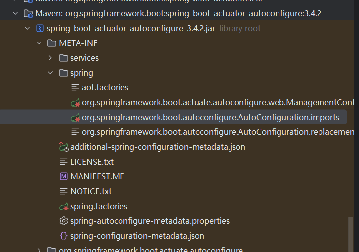

    打开就可以看到大量需要导入的类的全类名

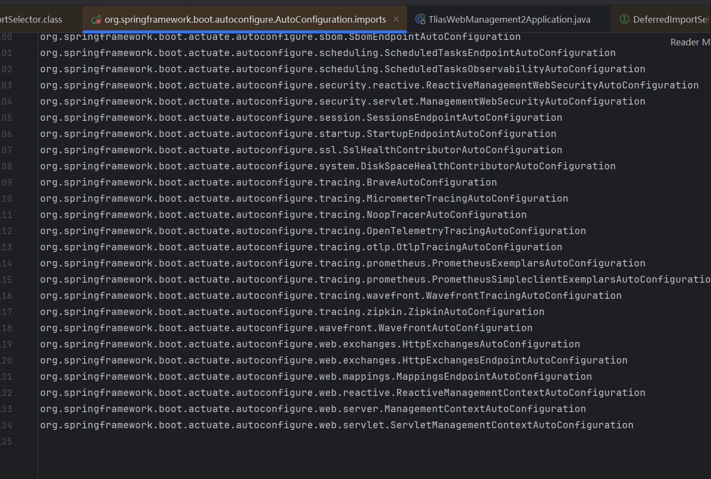

    随便进入一个都可以看到有`@AutoConfiguration`注解，表名是个配置类，里面的方法都用`@Bean`注解进行声明

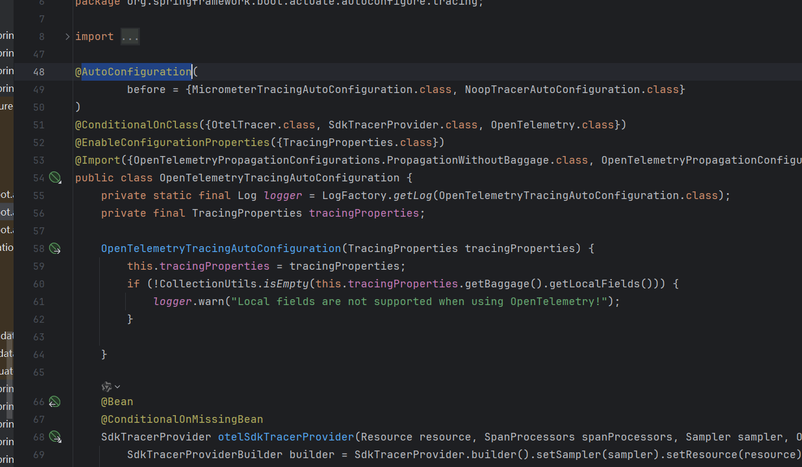

#### 条件装配注解（@Conditional）

- 作用：按照一定的条件进行判断，在满足给定条件后才会注册对应的bean对象到Spring IOC容器中

- 位置：方法、类

- 注解@Conditional本身是一个父注解，派生出大量的子注解：
  
  - `@ConditionalOnClass`：环境中有对应字节码文件，才注册bean到IOC容器。
  
  - `@ConditionalOnMissingBean`：环境中`没有`对应的bean（“类型”(value属性)或“名称”(name属性)），才注册bean到IOC容器
  
  - `@ConditionalOnProperty`：配置文件中有对应属性和值，才注册bean到IOC容器。
