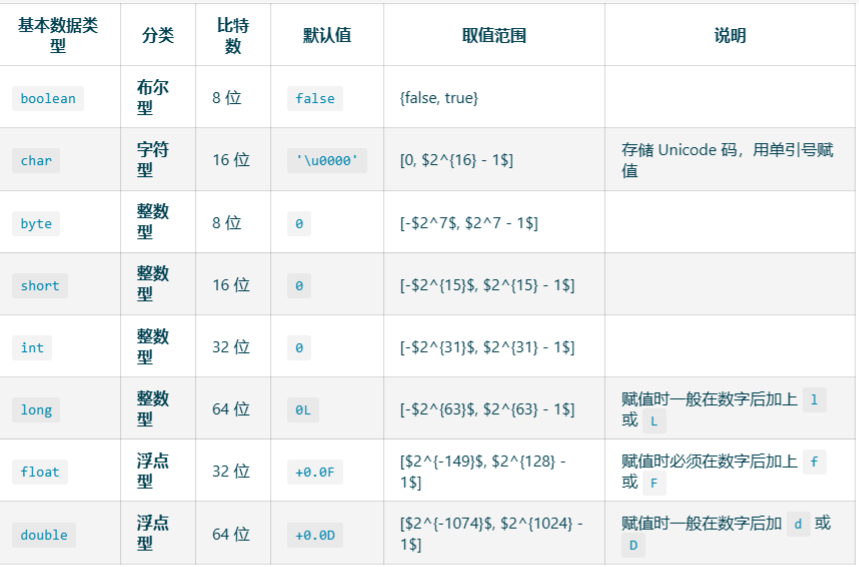

# Java基本数据类型

## 数据分类

Java共有8中数据类型，大致分为四种类型



### 值类型与引用类型

- 内存上
  - 基本类型：声明之后，java就会立刻分配给他内存空间
  - 引用类型：它以特殊的方式（类似 C 指针）向对象实体（具体的值），这类变量声明时不会分配内存，只是存储了一个内存地址。
- 使用上
  - 基本类型：使用时需要赋具体值,判断时使用 `==` 号。
  - 引用类型：使用时可以赋 null，判断时使用 `equals` 方法。

## 包装类

 ### 包装类型可以为 null，而基本类型不可以

别小看这一点区别，它使得包装类型可以应用于 POJO 中，而基本类型则不行。POJO 就是无规则的Java对象，只有属性字段和setter、getter

为什么POJO的属性一定是包装类？

根据《阿里巴巴 Java 开发手册》，数据库的查询结果可能是 null，如果使用基本类型的话，因为要自动拆箱（将包装类型转为基本类型，比如说把 Integer 对象转换成 int 值），就会抛出 `NullPointerException` 的异常。

### 包装类型可用于泛型，而基本类型不可以

为什么呢？因为泛型在编译时会进行类型擦除，最后只保留原始类型，而原始类型只能是 Object 类及其子类——基本类型是个特例。

### 基本类型比包装类型更高效

基本类型在栈中直接存储的具体数值，而包装类型则存储的是堆中的引用。 很显然，相比较于基本类型而言，包装类型需要占用更多的内存空间。假如没有基本类型的话，对于数值这类经常使用到的数据来说，每次都要通过 new 一个包装类型就显得非常笨重。


### 装箱与拆箱

`包装类的目的：提供一种机制，使得基本数据类型可以与引用类型互相转换。`

==装箱==：**是将值类型转换为引用类型**。例如：`int` 转 `Integer`

- 装箱过程是通过调用包装类的 `valueOf` 方法实现的。

==拆箱==:**是将引用类型转换为值类型**。例如：`Integer` 转 `int`

- 拆箱过程是通过调用包装类的 `xxxValue` 方法实现的。（xxx 代表对应的基本数据类型）。

#### 自动装箱、自动拆箱

JDK5时候是自动装箱

`Integer i1 = new Integer(10); // 非自动装箱`

`Integer i2 = 10; // 自动装箱`

- Integer、Short、Byte、Character、Long这几个类的VvauleOf方法实现一样，Double、Float的valueOf方法的实现是类似的。

- 以Short的valueOf()为例,对于数字为-128~127之间的数，可以直接用存在的对象，不需要再创建对象，否则需要创建对象

- 可以设置JVM`参数-XX:AutoBoxCacheMax=N`修改缓存上限值

  ```java
  @IntrinsicCandidate
  public static Short valueOf(short s) {
      final int offset = 128;
      int sAsInt = s;
      if (sAsInt >= -128 && sAsInt <= 127) { // must cache
          return ShortCache.cache[sAsInt + offset];
      }
      return new Short(s);
  }
  ```

##### 装箱、拆箱应用场景

- 一种最普通的场景是：调用一个**含类型为 `Object` 参数的方法**，该 `Object` 可支持任意类型（因为 `Object` 是所有类的父类），以便通用。当你需要将一个值类型（如 int）传入时，需要使用 `Integer` 装箱。
- 另一种用法是：一个**非泛型的容器**，同样是为了保证通用，而将元素类型定义为 `Object`。于是，要将值类型数据加入容器时，需要装箱。
- 当 `==` 运算符的两个操作，一个操作数是包装类，另一个操作数是表达式（即包含算术运算）则比较的是数值（即会触发自动拆箱的过程）。

##### 装箱、拆箱应用注意点

1. 装箱操作会创建对象，频繁的装箱操作会造成不必要的内存消耗，影响性能。所以**应该尽量避免装箱。**

   1. 比如频繁对一个包装类进行计算，可能会频繁的拆箱和装箱，最后对性能来说是低效的

      ```java
      long t1 = System.currentTimeMillis();
      Long sum = 0L;
      for (int i = 0; i < Integer.MAX_VALUE;i++) {
      sum += i;
      }
      long t2 = System.currentTimeMillis();
      System.out.println(t2-t1);
      ```

      

2. 基础数据类型的比较操作使用 `==`，包装类的比较操作使用 `equals` 方法。

## 判断问题

### 包装类的判断

- 对于包装类，需要使用equals进行内容判断，不能使用==

### String的判断

- 和前面的包装类比较像，如果是直接`String = "强强委屈"`就直接用到常量池存在的池，如果`String = new String("qweq")`,则需要用到equals()比较，如果`String = new String("qweq").intern()`,可以用==进行比较
- 注意：不能滥用`String = new String("qweq").intern()`，否则会减低性能，因为党字符串数量很大的时候，区常量池查询的时候会降低系统性能，可以设置 JVM 参数 -XX:StringTableSize=10000000，指定更多的桶，提高速度

### 实现equals

- 考虑到性能，可以先进行指针判等，如果对象是同一个那么直接返回 true；
- 需要对另一方进行判空，空对象和自身进行比较，结果一定是 fasle；
- 需要判断两个对象的类型，如果类型都不同，那么直接返回 false；
- 确保类型相同的情况下再进行类型强制转换，然后逐一判断所有字段。

### hashCode 和 equals 要配对实现

```java
Point p1 = new Point(1, 2, "a");
Point p2 = new Point(1, 2, "b");

HashSet<PointWrong> points = new HashSet<>();
points.add(p1);
log.info("points.contains(p2) ? {}", points.contains(p2));
//输出结果为false
```

分析原因，因为对于散表，需要借助于hashcode进行分配桶，如果没有自定义hashcode，就会使用Objec类的默认实现方法，就会得到两个不同hashcode

### compareTo 和 equals 的逻辑一致性

错误自定义compareTo

```java
@Data
@AllArgsConstructor
static class Student implements Comparable<Student> {

    private int id;
    private String name;

    @Override
    public int compareTo(Student other) {
        int result = Integer.compare(other.id, id);
        if (result == 0) { log.info("this {} == other {}", this, other); }
        return result;
    }

}

```

修改后

```java
@Data
@AllArgsConstructor
static class StudentRight implements Comparable<StudentRight> {

    private int id;
    private String name;

    @Override
    public int compareTo(StudentRight other) {
        return Comparator.comparing(StudentRight::getName)
            .thenComparingInt(StudentRight::getId)
            .compare(this, other);
    }

}

```

### 小心 Lombok 生成代码的“坑”

Lombok 的 @Data 注解会帮我们实现 equals 和 hashcode 方法，但是有继承关系时， Lombok 自动生成的方法可能就不是我们期望的了。

@EqualsAndHashCode 默认实现没有使用父类属性。为解决这个问题，我们可以手动设置 callSuper 开关为 true，来覆盖这种默认行为。

## 数值计算

### 浮点数计算问题

因为计算机是以二进制的方式进行存储数值的，对于浮点数计算会产生精度缺失

```java
System.out.println(0.1 + 0.2); // 0.30000000000000004
System.out.println(1.0 - 0.8); // 0.19999999999999996
System.out.println(4.015 * 100); // 401.49999999999994
System.out.println(123.3 / 100); // 1.2329999999999999
double amount1 = 2.15;
double amount2 = 1.10;
System.out.println(amount1 - amount2); // 1.0499999999999998

```

**浮点数无法精确表达和运算的场景，一定要使用 BigDecimal 类型**。

```java
System.out.println(new BigDecimal(0.1).add(new BigDecimal(0.2)));
// Output: 0.3000000000000000166533453693773481063544750213623046875

System.out.println(new BigDecimal(1.0).subtract(new BigDecimal(0.8)));
// Output: 0.1999999999999999555910790149937383830547332763671875

System.out.println(new BigDecimal(4.015).multiply(new BigDecimal(100)));
// Output: 401.49999999999996802557689079549163579940795898437500

System.out.println(new BigDecimal(123.3).divide(new BigDecimal(100)));
// Output: 1.232999999999999971578290569595992565155029296875

```

发现结果不对，**使用 BigDecimal 表示和计算浮点数，且务必使用字符串的构造方法来初始化 BigDecimal，或者用`BigDecimal.vauleOf()`静态方法创建对象，因为里面对double或者flaot进行了toString()**。

```java
BigDecimal num1 = new BigDecimal("0.1");
        BigDecimal num2 = new BigDecimal("0.2");
        System.out.println(num1.add(num2)); // 0.3
```

结果正确

**在进行除法时，应该指定其保留几位小数scal，否则出现除不尽的情况会报ArithmeticException 异常**

```java
public BigDecimal divide(BigDecimal divisor, int scale, RoundingMode roundingMode) {
    return divide(divisor, scale, roundingMode.oldMode);
}
```

在我们使用 `divide` 方法的时候尽量使用 3 个参数版本，并且`RoundingMode` 不要选择 `UNNECESSARY`，否则很可能会遇到 `ArithmeticException`（无法除尽出现无限循环小数的时候），其中 `scale` 表示要保留几位小数，`roundingMode` 代表保留规则

### 浮点数精度和格式化

**浮点数的字符串格式化也要通过 BigDecimal 进行**。

```java
private static void wrong1() {
    double num1 = 3.35;
    float num2 = 3.35f;
    System.out.println(String.format("%.1f", num1)); // 3.4
    System.out.println(String.format("%.1f", num2)); // 3.3
}

private static void wrong2() {
    double num1 = 3.35;
    float num2 = 3.35f;
    DecimalFormat format = new DecimalFormat("#.##");
    format.setRoundingMode(RoundingMode.DOWN);
    System.out.println(format.format(num1)); // 3.35
    format.setRoundingMode(RoundingMode.DOWN);
    System.out.println(format.format(num2)); // 3.34
}

private static void right() {
    BigDecimal num1 = new BigDecimal("3.35");
    BigDecimal num2 = num1.setScale(1, BigDecimal.ROUND_DOWN);
    System.out.println(num2); // 3.3
    BigDecimal num3 = num1.setScale(1, BigDecimal.ROUND_HALF_UP);
    System.out.println(num3); // 3.4
}

```

### BigDecimal 判等问题

```java
private static void wrong() {
    System.out.println(new BigDecimal("1.0").equals(new BigDecimal("1")));
}

private static void right() {
    System.out.println(new BigDecimal("1.0").compareTo(new BigDecimal("1")) == 0);
}
```

BigDecimal 的 equals 方法的注释中说明了原因，equals 比较的是 BigDecimal 的 value 和 scale，1.0 的 scale 是 1，1 的 scale 是 0，所以结果一定是 false。

**如果我们希望只比较 BigDecimal 的 value，可以使用 compareTo 方法**，compareTo可以忽略精度。

但是对于将BigDecimal 存入lsit等集合中，会有hashcode的问题，这里有两种方法：

- 第一个方法是，使用 TreeSet 替换 HashSet。TreeSet 不使用 hashCode 方法，也不使用 equals 比较元素，而是使用 compareTo 方法，所以不会有问题。
- 第二个方法是，把 BigDecimal 存入 HashSet 或 HashMap 前，先使用 stripTrailingZeros 方法去掉尾部的零，比较的时候也去掉尾部的 0，确保 value 相同的 BigDecimal，scale 也是一致的。

```java
Set<BigDecimal> hashSet2 = new HashSet<>();
hashSet2.add(new BigDecimal("1.0").stripTrailingZeros());
System.out.println(hashSet2.contains(new BigDecimal("1.000").stripTrailingZeros()));//返回true

Set<BigDecimal> treeSet = new TreeSet<>();
treeSet.add(new BigDecimal("1.0"));
System.out.println(treeSet.contains(new BigDecimal("1")));//返回true

```

**注意：在使用BigDecimal进行保留有效位时，[建议保留规则设置为roundingMode.HAFL_EVEN](https://github.com/Snailclimb/JavaGuide/issues/2129)**

### 数值溢出

```java
long l = Long.MAX_VALUE;
System.out.println(l + 1); // -9223372036854775808
System.out.println(l + 1 == Long.MIN_VALUE); // true

```

**显然这是发生了溢出，而且是默默的溢出，并没有任何异常**。这类问题非常容易被忽略，改进方式有下面 2 种。

方法一是，考虑使用 Math 类的 addExact、subtractExact 等 xxExact 方法进行数值运算，这些方法可以在数值溢出时主动抛出异常。

```java
try {
    long l = Long.MAX_VALUE;
    System.out.println(Math.addExact(l, 1));
} catch (Exception ex) {
    ex.printStackTrace();
}

```

方法二是，使用大数类 BigInteger。BigDecimal 是处理浮点数的专家，而 BigInteger 则是对大数进行科学计算的专家。

```java
BigInteger i = new BigInteger(String.valueOf(Long.MAX_VALUE));
System.out.println(i.add(BigInteger.ONE).toString());

try {
    long l = i.add(BigInteger.ONE).longValueExact();
} catch (Exception ex) {
    ex.printStackTrace();
}

```

------

## BigDecimal的4个坑

### 第一：浮点类型的坑

此时就得出一个基本的结论：**第一，在使用BigDecimal构造函数时，尽量传递字符串而非浮点类型；第二，如果无法满足第一条，则可采用BigDecimal#valueOf方法来构造初始化值**。

### 第二：浮点精度的坑

**通常情况，如果比较两个BigDecimal值的大小，采用其实现的compareTo方法；如果严格限制精度的比较，那么则可考虑使用equals方法**。

### 第三：设置精度的坑

**在使用BigDecimal进行（所有）运算时，一定要明确指定精度和舍入模式**。

拓展一下，舍入模式定义在RoundingMode枚举类中，共有8种：

- RoundingMode.UP：舍入远离零的舍入模式。在丢弃非零部分之前始终增加数字(始终对非零舍弃部分前面的数字加1)。注意，此舍入模式始终不会减少计算值的大小。
- RoundingMode.DOWN：接近零的舍入模式。在丢弃某部分之前始终不增加数字(从不对舍弃部分前面的数字加1，即截短)。注意，此舍入模式始终不会增加计算值的大小。
- RoundingMode.CEILING：接近正无穷大的舍入模式。如果 BigDecimal 为正，则舍入行为与 ROUNDUP 相同;如果为负，则舍入行为与 ROUNDDOWN 相同。注意，此舍入模式始终不会减少计算值。
- RoundingMode.FLOOR：接近负无穷大的舍入模式。如果 BigDecimal 为正，则舍入行为与 ROUNDDOWN 相同;如果为负，则舍入行为与 ROUNDUP 相同。注意，此舍入模式始终不会增加计算值。
- RoundingMode.HALF_UP：向“最接近的”数字舍入，如果与两个相邻数字的距离相等，则为向上舍入的舍入模式。如果舍弃部分 >= 0.5，则舍入行为与 ROUND_UP 相同;否则舍入行为与 ROUND_DOWN 相同。注意，这是我们在小学时学过的舍入模式(四舍五入)。
- RoundingMode.HALF_DOWN：向“最接近的”数字舍入，如果与两个相邻数字的距离相等，则为上舍入的舍入模式。如果舍弃部分 > 0.5，则舍入行为与 ROUND_UP 相同;否则舍入行为与 ROUND_DOWN 相同(五舍六入)。
- RoundingMode.HALF_EVEN：向“最接近的”数字舍入，如果与两个相邻数字的距离相等，则向相邻的偶数舍入。如果舍弃部分左边的数字为奇数，则舍入行为与 ROUNDHALFUP 相同;如果为偶数，则舍入行为与 ROUNDHALF_DOWN 相同。注意，在重复进行一系列计算时，此舍入模式可以将累加错误减到最小。此舍入模式也称为“银行家舍入法”，主要在美国使用。四舍六入，五分两种情况。如果前一位为奇数，则入位，否则舍去。以下例子为保留小数点1位，那么这种舍入方式下的结果。1.15 ==> 1.2 ,1.25 ==> 1.2
- RoundingMode.UNNECESSARY：断言请求的操作具有精确的结果，因此不需要舍入。如果对获得精确结果的操作指定此舍入模式，则抛出ArithmeticException。

**通常我们使用的四舍五入即RoundingMode.HALF_UP或者RoundingMode.HALF_EVEN（更加科学）。**

### 第四：三种字符串输出的坑

这里我们需要了解BigDecimal转换字符串的三个方法

- toPlainString()：不使用任何科学计数法；
- toString()：在必要的时候使用科学计数法；
- toEngineeringString() ：在必要的时候使用工程计数法。类似于科学计数法，只不过指数的幂都是3的倍数，这样方便工程上的应用，因为在很多单位转换的时候都是10^3；

**根据数据结果展示格式不同，采用不同的字符串输出方法，通常使用比较多的方法为toPlainString()** 。

NumberFormat类的format()方法可以使用BigDecimal对象作为其参数，可以利用BigDecimal对超出16位有效数字的货币值，百分值，以及一般数值进行格式化控制。

```java
NumberFormat currency = NumberFormat.getCurrencyInstance(); //建立货币格式化引用
NumberFormat percent = NumberFormat.getPercentInstance();  //建立百分比格式化引用
percent.setMaximumFractionDigits(3); //百分比小数点最多3位
​
BigDecimal loanAmount = new BigDecimal("15000.48"); //金额
BigDecimal interestRate = new BigDecimal("0.008"); //利率
BigDecimal interest = loanAmount.multiply(interestRate); //相乘
​
System.out.println("金额:\t" + currency.format(loanAmount));
System.out.println("利率:\t" + percent.format(interestRate));
System.out.println("利息:\t" + currency.format(interest));

```

输出：

```text
金额: ￥15,000.48 
利率: 0.8% 
利息: ￥120.00
```

总之，性能上可能没有Double和flaot高，不必要的时候，少用BigDecimal

## 面试问题

### int和Integer的区别？

- 使用静态工厂方法 valueOf 会使用到缓存机制，那么自动装箱的时候，缓存机制起作用吗？

- 为什么我们需要原始数据类型，Java 的对象似乎也很高效，应用中具体会产生哪些差异？

- 阅读过 Integer 源码吗？分析下类或某些方法的设计要点。

  ```java
  private static class IntegerCache {
          static final int low = -128;
          static final int high;
          static final Integer cache[];
          static {
              // high value may be configured by property
              int h = 127;
              String integerCacheHighPropValue =                VM.getSavedProperty("java.lang.Integer.IntegerCache.high");
              ...
              // range [-128, 127] must be interned (JLS7 5.1.7)
              assert IntegerCache.high >= 127;
          }
          ...
    }
  ```

  - 可以看到IntegerCache的成员变量都被声明为私有，静态，它们也是不可变类型，提高了安全性
  - 使用原始类型，可以适用再跨平台系统上，不管是系统是32为还是64位，无需担心数据的位数差异
  - 原始类型安全
    - 对于有线程安全的计算，可以采用类似 AtomicInteger、AtomicLong 这样的线程安全类。
    - 对于追求精度的类型如flaot、double，不能保证其原子操作，可能出现只更新一半数据位的数值
    - 原始类型无法与泛型一起使用
    - 原始数组在内存是连续存储的形式，而对象存储的是地址，在内存中是分散存储的，因为无法充分利用CPU缓存机制


