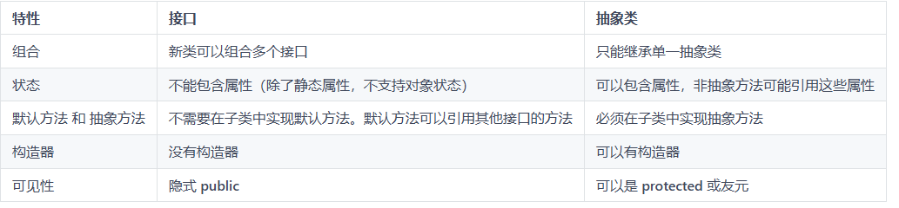

# 抽象类和接口

## 接口

- 接口是对行为的抽象，是抽象方法的集合，达到API与实现分离的目的

- 接口里面的方法都是默认的静态方法，没有非静态方法

- 不能实例化，引用接口时需要实现接口中的所有方法

- 默认方法
  - 通过在接口中的方法前加上default关键字，继承其接口的类不需要重写这个方法

- 完全解耦
  - 当方法操纵的是一个类而非接口时，它就只能作用于那个类或其子类。如果想把方法应用于那个继承层级结构之外的类，就会触霉头。接口在很大程度上放宽了这个限制，因而使用接口可以编写复用性更好的代码。
  - 创建一个能根据传入的参数类型从而具备不同行为的方法称为*策略*设计模式。

- 接口适配
  - 所以这就意味着一个接受接口类型的方法提供了一种让任何类都可以与该方法进行适配的方式。这就是使用接口而不是类的强大之处。‘

  - 其中Scanner的构造器就是需要传入Readable对象，如果其它类需要用到Scanner，就需要继承接口Readable。这里就是StringReader继承类Reader，因此可以使用scanner。详细可以去查找java具体源代码实现

    ```java
    public final class Scanner implements Iterator<String>, Closeable {
        public Scanner(Readable source) {
            this(Objects.requireNonNull(source, "source"), WHITESPACE_PATTERN);
        }
    }
    public interface Readable {
        public int read(java.nio.CharBuffer cb) throws IOException;
    }
    public abstract class Reader implements Readable, Closeable {
    //...其它实现方法
    }
    public class StringReader extends Reader {
    
        public StringReader(String s) {
            this.str = s;
            this.length = s.length();
        }
    }
     public static void main(String[] args) {
          Scanner s = new Scanner(new StringReader("asdas"));
        }
    
    ```

- 接口嵌套

  - 接口也可以是私有的，实现 **private** 接口是一种可以强制该接口中的方法定义不会添加任何类型信息（即不可以向上转型）的方式。

  - 接口之间也能嵌套。然而，作用于接口的规则——尤其是，接口中的元素必须是 **public** 的——在此都会被严格执行，所以嵌套在另一个接口中的接口自动就是 **public** 的，不能指明为 **private**。

  - 当类实现接口时，尤其是当实现某个接口时，并不需要实现嵌套在其内部的接口。同时，**private** 接口不能在定义它的类之外被实现。

    ```java
    // interfaces/nesting/NestingInterfaces.java
    // {java interfaces.nesting.NestingInterfaces}
    package interfaces.nesting;
    
    class A {
        interface B {
            void f();
        }
        
        public class BImp implements B {
            @Override
            public void f() {}
        }
        
        public class BImp2 implements B {
            @Override
            public void f() {}
        }
        
        public interface C {
            void f();
        }
        
        class CImp implements C {
            @Override
            public void f() {}
        }
        
        private class CImp2 implements C {
            @Override
            public void f() {}
        }
        
        private interface D {
            void f();
        }
        
        private class DImp implements D {
            @Override
            public void f() {}
        }
        
        public class DImp2 implements D {
            @Override
            public void f() {}
        }
        
        public D getD() {
            return new DImp2();
        }
        
        private D dRef;
        
        public void receiveD(D d) {
            dRef = d;
            dRef.f();
        }
    }
    
    interface E {
        interface G {
            void f();
        }
        // Redundant "public"
        public interface H {
            void f();
        }
        
        void g();
        // Cannot be private within an interface
        //- private interface I {}
    }
    
    public class NestingInterfaces {
        public class BImp implements A.B {
            @Override
            public void f() {}
        }
        
        class CImp implements A.C {
            @Override
            public void f() {}
        }
        // Cannot implements a private interface except
        // within that interface's defining class:
        //- class DImp implements A.D {
        //- public void f() {}
        //- }
        class EImp implements E {
            @Override
            public void g() {}
        }
        
        class EGImp implements E.G {
            @Override
            public void f() {}
        }
        
        class EImp2 implements E {
            @Override
            public void g() {}
            
            class EG implements E.G {
                @Override
                public void f() {}
            }
        }
        
        public static void main(String[] args) {
            A a = new A();
            // Can't access to A.D:
            //- A.D ad = a.getD();
            // Doesn't return anything but A.D:
            //- A.DImp2 di2 = a.getD();
            // cannot access a member of the interface:
            //- a.getD().f();
            // Only another A can do anything with getD():
            A a2 = new A();
            a2.receiveD(a.getD());
        }
    }
    ```

- 接口和工厂方法模式

  - 接口是多实现的途径，而生成符合某个接口的对象的典型方式是*工厂方法*设计模式。不同于直接调用构造器，只需调用工厂对象中的创建方法就能生成对象的实现——理论上，通过这种方式可以将接口与实现的代码完全分离，使得可以透明地将某个实现替换为另一个实现

    ```java
    // interfaces/Factories.java
    interface Service {
        void method1();
        void method2();
    }
    
    interface ServiceFactory {
        Service getService();
    }
    
    class Service1 implements Service {
        Service1() {} // Package access
        
        @Override
        public void method1() {
            System.out.println("Service1 method1");
        }
        
        @Override
        public void method2() {
            System.out.println("Service1 method2");
        }
    }
    
    class Service1Factory implements ServiceFactory {
        @Override
        public Service getService() {
            return new Service1();
        }
    }
    
    class Service2 implements Service {
        Service2() {} // Package access
        
        @Override
        public void method1() {
            System.out.println("Service2 method1");
        }
        
        @Override
        public void method2() {
            System.out.println("Service2 method2");
        }
    }
    
    class Service2Factory implements ServiceFactory {
        @Override
        public Service getService() {
            return new Service2();
        }
    }
    
    public class Factories {
        public static void serviceConsumer(ServiceFactory fact) {
            Service s = fact.getService();
            s.method1();
            s.method2();
        }
        
        public static void main(String[] args) {
            serviceConsumer(new Service1Factory());
            // Services are completely interchangeable:
            serviceConsumer(new Service2Factory());
        }
    }
    ```

  - 对于为什么需要创建间接层ServiceFactory，因为需要创建框架

- 总结：设置工厂或者时接口，需要根据具体的需求去设计，而不是开始就去加接口和工厂

## 抽象类

-  抽象的目的主要是代码复用，对于继承后的类，需要实现父类中的抽线方法，但是对于非抽象方法则不需要，非抽象方法则可以设置为共同的方法

**抽象类和接口的区别：接口与抽象类最明显的区别可能就是使用上的惯用方式。接口的典型使用是代表一个类的类型或一个形容词，如 Runnable 或 Serializable，而抽象类通常是类层次结构的一部分或一件事物的类型，如 String 或 ActionHero。**



## 面向对象设计

- SOLID原则 

  - 单一职责（Single Responsibility），类或者对象最好是只有单一职责，在程序设计中如果发现某个类承担着多种义务，可以考虑进行拆分。

  - **开关原则（Open-Close, Open for extension, close for modification），设计要对扩展开放，对修改关闭。换句话说，程序设计应保证平滑的扩展性，尽量避免因为新增同类功能而修改已有实现，这样可以少产出些回归（regression）问题。**

    - 示例

      ```java
      //未修改前的代码   
      public class VIPCenter {
            void serviceVIP(T extend User user>) {
               if (user instanceof SlumDogVIP) {
                  // 穷X VIP，活动抢的那种
                  // do somthing
                } else if(user instanceof RealVIP) {
                  // do somthing
                }
                // ...
            }
      ```

      ```java
      // 利用开关原则修改代码，对代码实现解耦，当新的类增加的时候，就不会影响到其它类
      public class VIPCenter {
             private Map<User.TYPE, ServiceProvider> providers;
             void serviceVIP(T extend User user） {
                providers.get(user.getType()).service(user);
             }
           }
           interface ServiceProvider{
             void service(T extend User user) ;
           }
           class SlumDogVIPServiceProvider implements ServiceProvider{
             void service(T extend User user){
               // do somthing
             }
           }
           class RealVIPServiceProvider implements ServiceProvider{
             void service(T extend User user) {
               // do something
             }
           } 
      ```

      

  - 里氏替换（Liskov Substitution），这是面向对象的基本要素之一，进行继承关系抽象时，凡是可以用父类或者基类的地方，都可以用子类替换。

  - 接口分离（Interface Segregation），我们在进行类和接口设计时，如果在一个接口里定义了太多方法，其子类很可能面临两难，就是只有部分方法对它是有意义的，这就破坏了程序的内聚性。- 对于这种情况，可以通过拆分成功能单一的多个接口，将行为进行解耦。在未来维护中，如果某个接口设计有变，不会对使用其他接口的子类构成影响。

  - 依赖反转（Dependency Inversion），实体应该依赖于抽象而不是实现。也就是说高层次模块，不应该依赖于低层次模块，而是应该基于抽象。实践这一原则是保证产品代码之间适当耦合度的法宝

  - 接口适配（未看）