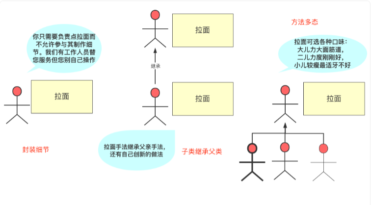

# 面向对象的三大特性

## 封装

- 封装更容易地修改类的内部实现，无需修改该类的代码

## 继承

- 继承就是子类继承父类的属性和方法，使得子类对象（实例）具有父类的属性和方法，或子类从父类继承方法，使得子类具有父类相同的方法。
- 多继承方式
  - 接口、内部类、多层继承
- 如果子类的构造方法中没有显示地调用父类构造方法，则系统默认调用父类无参数的构造方法。
- 子父类初始化顺序
  - 父类中静态成员变量和静态代码块
  - 子类中静态成员变量和静态代码块
  - 父类中普通成员变量和代码块，父类的构造方法
  - 子类中普通成员变量和代码块，子类的构造方法

## 多态

- 多态的前提条件有三个：

  - 子类继承父类
  - 子类重写父类的方法
  - 父类引用指向子类的对象，即：父类类名 引用名称 = new 子类类名();

- 多态与向下转型

  - 当父类引用指向的是父类对象时，这时候强转就会报错

- 向上转型和向下转型

  ```java
  class Animal {
      void makeNosie(){
          system.println.out("noise");
      }
  }
  ```

  ```java
  class Dog extend Animal {
      @overried
      void makeNosie(){
          system.println.out("汪汪");
      } 
      void growl(){
          system.println.out("growl");
      }
  }
  ```

  ```java
  //启动类
  public static void main(String[] args){
      Animal animal  = new Dog();
      animal.makeNosie(); // 输出为汪汪
      animal.growl();//运行正确
      doAnimalStuff(animal);
  }
  //下面写法,就不需要为每个动物创建，只需要通过向上转型即可
  void doAnimalStuff(Animal animal){
      animal.makeNosie();
  }
  ```

  ```java
  //启动类2，向下转型
  public static void main(String[] args){
      Cat cat  = new Cat();
      doAnimalStuff(animal);
  }
  //下面写法,就不需要为每个动物创建，只需要通过向上转型即可
  void doAnimalStuff(Animal animal){
      animal.makeNosie();
      Dog dog  = (Dog)animal;//此时会报类型转换错误
      dog.growl();
      //解决方案,通过验证类型
      if(animal instanceof Dog){
          Dog dog  = (Dog)animal;
          dog.growl();
      }
  }
  ```

- 多态实现方式

  - 场景：加入有一个老师，需要给每个学生评价

  - 不使用多态的实现

    - 一个老师Student，老师Teacher，学生A，学生B

    ```java
    public abstract class Student {
        public void evaluate() {
            System.out.println("系统评价！");
        }
    }
    ```
    
    ```java
    public  class Teacher {
        public void evaluateTeacher(A a) {
           a.evaluate();
        }
         public void evaluateTeacher(B b) {
           b.evaluate();
        }
    }
    ```
    
    ```java
    public  class A {
        public void evaluate() {
            System.out.println("系统评价A！");
        }
    }
    ```
    
    ```java
    public  class B {
        public void evaluate() {
            System.out.println("系统评价B！");
        }
    }
    ```
    
    使用多态实现，只需要修改Teacher类
    
    ```java
    public  class Teacher {
        public void evaluateTeacher(Sudent s) {
           s.evaluate();
        }
    }
    ```

## 总结



上述链接如下：[深入理解Java三大特性：封装、继承和多态 | 二哥的Java进阶之路](https://javabetter.cn/oo/encapsulation-inheritance-polymorphism.html)


