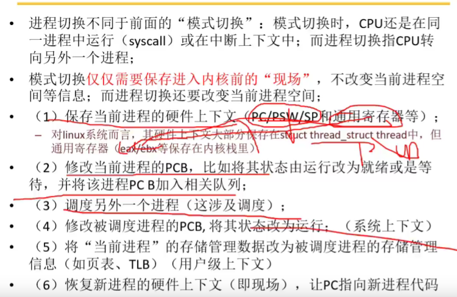
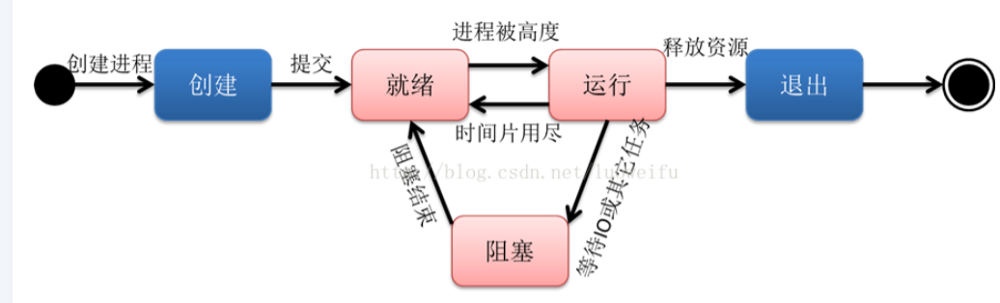
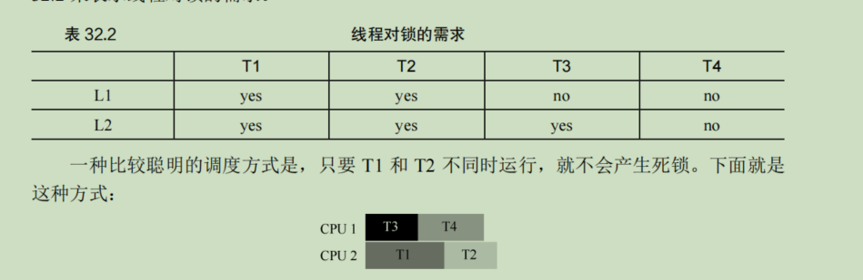
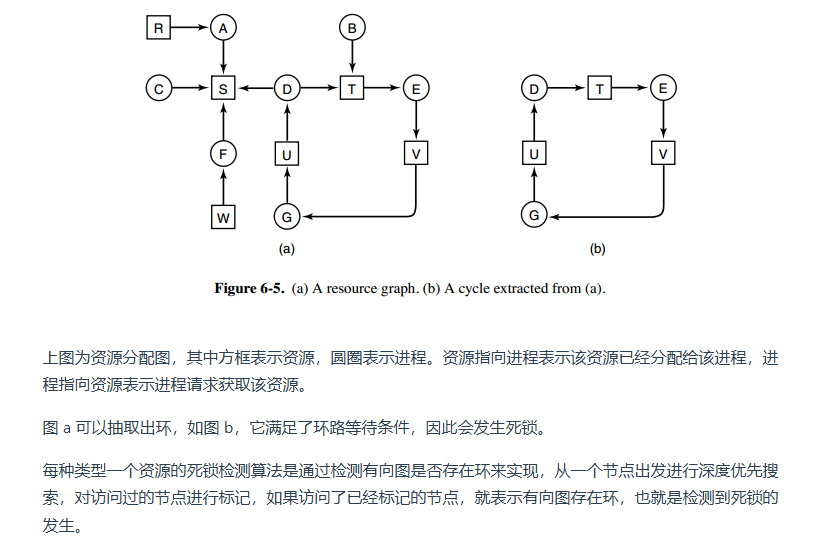
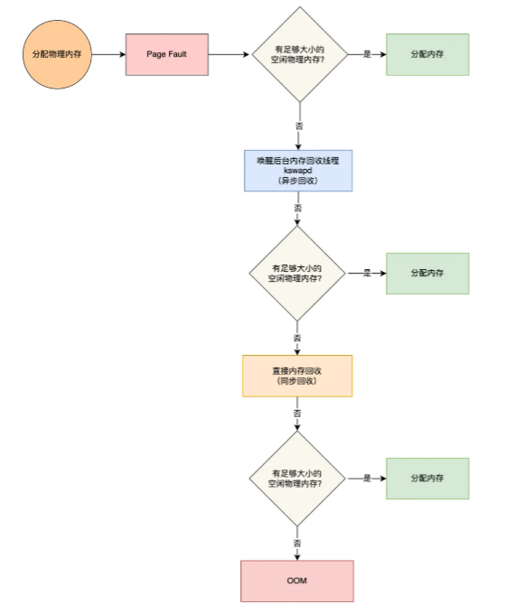

## 一、系统结构

cpu cache是存储频繁访问的数据，内存是存储要执行的程序和数据，磁盘则长期存储数据和大量数据

总体上，硬中断包括中断、异常、INT指令软件中断，不管是CPU自己触发还是外部设备触发的，都叫硬中断

硬中断的原理上，当CPU在每个指令周期的最后，都会留一个周期来查看是否中断，如果有将中断信号取出，在中断向量表中寻找中断程序，最后跳出

软中断的原理上，有一个单独的守护进程，不断轮询标志位，当标志位有值了，去对应位置，找到软中断函数，最后跳出

关于系统结构的总结

## 二、进程管理

- 上下文切换的必要性：当两个进程执行的时候，为了能够恢复上一个进程的信息，需要保存上下文

- 进程

  - 进程的通信
    - 管道，不能够同时通信
    - 消息队列，当A进程写入数据时，需要将数据复制到内核中，B进程读的时候需要将数据从内核中复制出来
    - 共享内存：A,B进程共享同一个内存空间，但是存在同时修改，出现数据的覆盖和混乱
    - 信号量
      - 互斥信号量，信号初始为1：
        - 进程 A 在访问共享内存前，先执行了 P 操作，由于信号量的初始值为 1，故在进程 A 执行 P 操作后信号量变为 0，表示共享资源可用，于是进程 A 就可以访问共享内存。
        - 若此时，进程 B 也想访问共享内存，执行了 P 操作，结果信号量变为了 -1，这就意味着临界资源已被占用，因此进程 B 被阻塞。
        - 直到进程 A 访问完共享内存，才会执行 V 操作，使得信号量恢复为 0，接着就会唤醒阻塞中的线程 B，使得进程 B 可以访问共享内存，最后完成共享内存的访问后，执行 V 操作，使信号量恢复到初始值 1。
      - 同步信号量，信号初始为0：
        - 如果进程 B 比进程 A 先执行了，那么执行到 P 操作时，由于信号量初始值为 0，故信号量会变为 -1，表示进程 A 还没生产数据，于是进程 B 就阻塞等待；
        - 接着，当进程 A 生产完数据后，执行了 V 操作，就会使得信号量变为 0，于是就会唤醒阻塞在 P 操作的进程 B；
        - 最后，进程 B 被唤醒后，意味着进程 A 已经生产了数据，于是进程 B 就可以正常读取数据了

  

  - 信号
    - 主要是通过硬件来源和软件（kill）
    
    
    - Socket

  - 进程的上下文：用户及上下文（靠页表进行切换 ）、系统上下文
  - 包含运行-暂停-运行：创建-就绪-运行-阻塞-结束
  - 进程的上下文切换（地址空间、处理器切换）
    - 进程地址空间（虚拟地址）：当调度器切换到我的时候，保证是我的虚拟地址，实际地址存放在tlb中（页表基址寄存器）（通过页表+tlb进行切换），保证了进程访问指令数据时访问的是自己地址空间
    - 处理器切换：需要将上下文的信息保存在arm寄存器中，为了减少tlb清空的次数，可以采用ASID机制来减缓此情况
  - 进程的组成：内核栈、寄存器、页表、地址空间
    - 进程控制块（PCB）：并不是所有的信息都是保存在PCB中的，更多的是在PCB中保存一个指针，这个指针指向这个内存栈
    - 程序（用户栈）
      - 代码
      - 数据
      - 堆和栈

- 线程

- 并行

- 并发

- 线程与进程最大的区别在于：**线程是调度的基本单位，而进程则是资源拥有的基本单位**。线程上下文切换大的时候，地址空间不变（不需要用到页表），另一个区别在于栈，因为对于单线程的地址空间只有一个栈，二多个线程许哟啊多个栈

- 协程（用户态操作，区别于线程，线程是操作系统级别的）

  - 线程中可以有n个协程
  - 有栈协程   

  

​		-  函数栈的切换：每次到需要跳转到另一个函数的时候，需要保存当前函数的下一段执行的地址，当另一个函数执行返回的时候，就会跳转到相应的栈顶地址

- 调度算法

  - 抢占式（每个进程有一定的时间限制，到时间后，会重新排队）

  - 非抢占式（适合延时高的场景）

  - liunx进程分为两种

    - 实时交互需要  

      - ### Round-Robin 算法：这是一种循环队列，解决了大任务等待时间长的问腿

    - 普通进程

      - FCFS 先到先服务算法：对于短任务不友好
      - SJF 最短任务优先算法：
      - SRTF 最短剩余时间优先算法

  - 优先级队列：通过抢占+优先级方式设置线程调度方式，但是存在很多问题：1.如果一个任务的优先级很高，其实没必要进行抢占2.因为执行时间是未知的，不能保证最短任务优先抢占

    - 对于上述问题，我们可以采用多级队列，分为n级队列，最优先级队列（非抢占+优先级），低级队列（抢占+优先级，其中再可以细分最短+最长，如果长任务在规定的时间片里没有完成，将其放入下一级队列中去）

- 僵尸进程：由于子进程退出了，但是父进程并没有通过wait会waitpid获取子进程的状态信息，那么子进程的信息还是保存在系统中的

  - 危害：因为wait/waitpid可以获取子进程是否结束的地方，还占有进程号，因此如果当子进程退出的时候，不去读取的话，其还占有资源，因为进程号是有限的
  - 解决方法：可以通过信号机制，子进程退出的收，发送SIGKILL信号开杀死进程。确保删除子僵尸的唯一方法就是杀掉它们的父进程；如果要消灭系统中大量的僵死进程，只需要将其父进程杀死，此时所有的僵死进程就会编程孤儿进程，从而被init所收养，这样init就会释放所有的僵死进程所占有的资源，从而结束僵死进程。

- 孤儿进程：由于父进程退出了，子进程还在运行，那么子进程会被init1（进程号为1）进程收养

  - 因为被init收养，他会不断地监听他的子进程是否退出，因此他不会有危害

- 守护进程：是一种特殊的进程，非交互式程序，独立于控制终端并且周期性地执行某种任务或等待处理某些发生的事件

  - 常见的守护进程包括系统日志进程syslogd、 web服务器httpd、邮件服务器sendmail和数据库服务器mysqld等。

  - 创建守护进程步骤

    - 概念

      - 进程组：因为进程可以fork很多个子进程，进程组组长为每个进程的pid
      - 会话期：是一个或多个进程组的集合

    - 具体实现

      - （1）在父进程中执行fork并exit推出；

        （2）在子进程中调用setsid函数创建新的会话；为了禁止进程重新开启终端，将第一个子进程关闭

        （3）在子进程中调用chdir函数，让根目录 ”/” 成为子进程的工作目录；

        （4）在子进程中调用umask函数，设置进程的umask为0；

        （5）在子进程中关闭任何不需要的文件描述符

- 多线程 

  - activate.navicat.com
  - 临界区（多个线程共享的变量或数据结构）、竞态条件（多个线程同时进入临界区）、不确定性（多个竞态条件组成）、互斥执行（）

    - 当创建两个线程时，这两个线程都对同一个变量进行计数，cpu会执行三条指令：1、从内存取出变量，放入寄存器；2、对寄存器继续宁加一，最后放回内存中去。但是在放入内存之前，发生中断，这时第二个线程进行计数，从而与期望值不一样
  - 常见的线程同步方式：互斥锁、读写锁、条件变量、信号量
  - 锁（正确性、公平性、性能）（硬件更加强大的指令+操作系统支持（park()和unpark()原语以及Linux的futex））

    - 实现锁：获取增加（ticket锁实现了公平性）、链接加载和条件式存储指令、比较并交换、测试并设置
      - 测试并设置(tas指令)
        - 忙等待锁（自旋锁）：当锁被人持有时，处于一个自旋状态
        - 无等待锁：自旋时，让出cpu，将其加入到队列中
    - 自旋锁：在公平性上不能保证，性能上在多个CPU上更好，正确性可以保证
      - 解决自旋锁中空转产生不断的消耗CPU的方案
        - 采用让出的策略，虽然比之前多个线程同时空转消耗好些，但是仍然存在问题
        - 使用队列：休眠替代自旋。**测试和设置**加队列的方式
  - 并发锁

    - 更多并发不一定更快
    - 并发计数器
    - 并发链表
    - 并发队列
    - 并发散列表（大量使用）
  - 条件变量（用于生产者和消费者模型）

    - 在join线程的时候，条件变量可以保证信号的正确接收
  - 生产者/消费者（有界缓缓冲区）问题

    - 这里设涉及到互斥和同步，需要使用三个信号量，mutex用于互斥，fullBuffer用于同步（也就是缓冲区满槽的个数），emptyBuffers表示缓冲区空槽的个数
    - 存在两个消费者的情况下，如果其中一个消费者消费完，需要唤醒另一个线程，有可能唤醒的是另一个消费者，这就有可能导致消费者和生产者都处于休眠状态，应该避免这种情况的出现
    - 解决方案：使用两个条件变量，这样可以做到正确的唤醒特定的线程。对条件变量使用while（而不是if）
  - 覆盖条件

    - 这是一种广播域的唤醒所有的线程
  - 信号量（P操作：将sem减一，小于0时，线程进入阻塞，V操作：将sem加一，<=0时，唤醒一个等待中的线程，不会阻塞）：是一个整数的对象，用两个函数进行操作；操作系统提供的一种协调共享资源访问的方法
    - 总资源为1时：只需要使用信号量函数
    - 总资源大于1时：需要加入信号量函数和互斥锁，其中它们之间的顺序是不能改变的，信号量函数在前边，互斥锁在后边，反之会形成死锁
    - 实现互斥：初始值为1
    - 实现同步：初始值为0
      - 同步：多个线程按顺序执行

    - 二值信号量（锁）：初始值设为1
    - 信号量用作条件变量

      - 当出现两个生产者同时向缓冲区填入数据时，第一个生产者调用的时候，在改变数据大小加一的操作的时候，发生了中断，这是另一个生产者开始运行，这时候会覆盖掉之前的值，最后第一个生产者恢复运行。但是最后数据的大小为1
      - 解决方案：增加互斥量，但是增减互斥量应该在缓冲区之后，不然会出现死锁的风险
    - 哲学家就餐问题（对于互斥访问有限的竞争问题（如 I/O 设备）一类的建模过程十分有用）
      - 五个哲学家就餐，哲学家的之间都放在者一把餐叉，哲学家有时要思考一会儿，不需要餐叉，又是就餐，而一位哲学家只有同时拿到了左手边个右手边的两把餐叉，才能吃东西
      - 解决方案
        - 第一个就是增加互斥变量，这样只有一个哲学家进餐
        - 第二个就是采用分支结构，让偶数的哲学家先从左边拿再拿右边，奇数就相反
        - 第三个使用了一个信号量组，将哲学家的状态都标记进去，分为思考、进餐、饥饿（准备拿起餐具）
    - 读者--写者问题（为数据库访问建立一个模型）（互斥锁的升级版）

      - 读-读 允许：同一时刻允许多个读者同时读
      - 读-写 互斥：没有写者时读者才能读，没有读者时才能写者才能写
      - 写-写 互斥：没其他写者时，写者才能写
      - 解决方案
        - 方案一：读者优先，会造成写者处于饥饿状态
        - 方案二：写着优先，会造成读者处于饥饿状态
        - 方案三：实现公平策略，写者和读者是一对互斥关系
    - 常见并发问题

      - 非死锁缺陷

        - 违反原子性：违反了多次内存访问中预期的可串行性（即代码段本意是原子的，但在执行中并没有强制实现原子性），应该一起执行的指令序列没有一起执行
        - 违反顺序
      - 死锁缺陷：两个线程都持有锁，都在等待对方释放锁，从而陷入死锁

        - 一个原因是在大型的库里，组件之间会有复杂的依赖
        - 封装
        - 产生死锁的条件
          - 互斥
          - 持有并等待：手里面拿着一个资源，但是需要抢夺另一个资源，这时这个资源被占有了，但是不会释放掉持有的资源
          - 非抢占：相对于前面的抢占，只有当自己任务执行完之后才能释放这个持有的资源
          - 循环等待：如果将线程获取锁的顺序固定，就不会有循环等待的问题，但是采用全序和偏序都需要很细致的设计才行，可以通过锁的地址来强制锁的顺序
        - 解决死锁的方案
          - 利用工具排查死锁问题，在Java中可以使用jstack工具
          - 资源有序分配法：比如两个线程A,B，有资源X,Y，这两个线程只能有相同的顺序区获取资源
          - 无等待数据结构思想：通过强大的硬件指令，比如比较并交换指令
          - 通过调度：
          - 检查和恢复：预设系统发生死锁的次数很少，在他发生时才去采取措施
            - 检测：
              - 每种类型一个资源的死锁检测
              - 每种类型对多资源的死锁检测
                - 每个进程最开始时都不被标记，执行过程有可能被标记。当算法结束时，任何没有被标记的进程都是死锁进程。
                  - 寻找一个没有标记的进程 Pi，它所请求的资源小于等于 A。
                  - **E:**如果找到了这样一个进程，那么将 C 矩阵的第 i 行向量加到 A 中，标记该进程，并转回 1。
                  - 如果没有这样一个进程，算法终止（表示该进程陷入死锁）。

              - 安全状态
              - 单个资源的银行家算法
              - 多个资源的银行家算法
                - 检查一个状态是否安全的算法如下：
                  - 查找右边的矩阵是否存在一行小于等于向量 A。如果不存在这样的行，那么系统将会发生死锁，状态是不安全的。
                  - 假若找到这样一行，将该进程标记为终止，并将其已分配资源加到 A 中（这一步和**E**类似）。
                  - 重复以上两步，直到所有进程都标记为终止，则状态时安全的。

            - 恢复
              - 利用抢占
              - 回滚恢复
              - 杀死进程

          - 对共享资源访问完毕之后，一定要解锁，或则在枷锁的使用tryLock
          - 有多把锁，控制对锁的访问顺序，在对其它互斥锁做加锁操作之前，先释放当前线程拥有的互斥锁

      - 总结上述的互斥锁和自旋锁
        - 这两种锁是最底层的两种锁，都是会涉及到内核操作，获得锁，阻塞都会通过内核
        - 如果是使用休眠和唤醒的操作，会产生很大的开销时间，有时候代码执行的时间会小于线程上下文切换的时间，当出现这样的情况时，我们可以使用自旋锁
        - 自旋锁是通过CPU提供的CAS函数，在用户态就能完成加锁和解锁操作。不会发生上下文切换，相比互斥锁，开销会小很多。更加适合异步、协程等在用户态切换请求的编程方式
        - **当加锁失败时，互斥锁用「线程切换」来应对，自旋锁则用「忙等待」来应对**。其他锁都是基于这两种中其中一种锁进行升级的 
      - 乐观锁和悲观锁‘
        - 悲观锁：互斥锁、自旋锁（在CAS的基础上加上了while循环判断条件）、读写锁。在操作数据之前加锁
        - 乐观锁：CAS，没有锁，认为发生冲突概率很低，在发生错误后再进行修改。使用场景：在线编辑，git、SVN等版本控制工具
      - 去中心化方案：区块链的类比
        - 对于淘宝、京东等交易平台，我们可以让用户和商家直接进行交易，而不需要通过交易平台这个中心进行交易，但是需要考虑到安全性、有效性。
        - 可以采用一种区块链技术，每一个Block里面都存放着交易数据，每个Block都知道上一个节点是谁，也是保存上一个节点摘要签名（这和网站证书签名是一样的，摘要签名是由里面的数据加其他信息生成的，所以一旦具体信息修改了，摘要签名也就变了）
        - 解决其中的并发问题：如果有几十亿的人都在下单，每次下单都会创建一个Block，这样会创建很多的分支
          - 解决方案：允许商家开分支，各个商家可以独立做一个分支，隔一段时间将其分支进行合并到主分支
        - 其它技术解决并发问题：Lock-free队列、ThreadLocal

## 三、内存管理

- 内存虚拟化
  - 为了解决系统可以同时运行多个程序，就需要进程不能访问物理地址，从而提出虚拟地址，为每个进程提供单独的虚拟地址，不同的虚拟地址对应物理地址，每个进程互不干扰

  - 虚拟地址与物理地址之间的映射有两种方式：内存分段、分页

    - 内存分段

      - 分段可以减少内存的消耗，因为虚拟地址有空闲空间未用，如果直接放在内存中会浪费多余的空间
      - 分段由两部分组成：段选择因子和段内偏移量
        - 段选择因子：主要由段号，用作段表的索引，用于区分栈、堆、代码，段表保存由段基地址和段界限
      - 存在问题：内存碎片和内存交换效率低
        - 内存碎片：当多个程序运行的时候，会占用不同的内存空间，这时其中一个程序关闭腾出空间，这时另一个程序加载进来，但是内存中的空闲空间都是零碎的分布，并不是连续分布，这时空闲内存加在一起满足程序运行的内存，但是空闲空间不是连续的，无法使用
          - 解决方案：使用内存交换，将其中占用的程序先放在硬盘上，让后将者程序重新分出到内存中，但不是原来的位置，而是放在已占用空间的后面，从而解决了内存碎片
        - 内存交换效率低：因为硬盘的访问速度很慢，如果这个程序的内存空间很大，整个机器就会变得很卡
          - 解决方案：分页
      - 内存分页
        - 将整个虚拟和物理内存分为固定大小的空间，这样就不会出现分段出现的外部碎片，虚地地址和物理地址通过页表进行映射，如果页表中查询不到，就会产生**缺页异常**，从而进入内核空间，更新进程页表
        - 由于设置为固定的大小，当时固定大小里面会存在段与段之间的空闲内存，这就是内部碎片，解决方案就是如果内存空间不够，还是会用到内存交换，这时一次性磁盘的交换的空间只是少数的一页或者几页，从而大大提高了交换的效率
        - 但是简单的分页，会出现维妮塔，当多个程序同时运行时，会出现页表占用的空间很大，解决方案多级页表
        - 多级页表
          - 分为两级页表，一级页表用于保存页号，二级页表用于创建页表项，只有在程序运行时，才会创建，由于计算机的局部性原理，实际运行中的程序不会时100%。因此这样大大的减少了页表的占用内存
        - 通过使用TLB（地址转换），解决了地址转换的效率问题
      - 段页式内存管理
        - 分段和分页的混合使用，每个程序有一个段表，段表里面由段号、段内页号、页内位移三部分组成
        - 段页式地址变换中要得到物理地址须经过三次内存访问：
          - 第一次访问段表，得到页表起始地址；
          - 第二次访问页表，得到物理页号；
          - 第三次将物理页号与页内位移组合，得到物理地址。
      - Linux内存布局
        - **Linux 系统主要采用了分页管理，但是由于 Intel 处理器的发展史，Linux 系统无法避免分段管理**。于是 Linux 就把所有段的基地址设为 `0`，也就意味着所有程序的地址空间都是线性地址空间（虚拟地址），相当于屏蔽了 CPU 逻辑地址的概念，所以段只被用于访问控制和内存保护。
        - 32位的系统，用户的内存为3G，64为i系统，用户的内存为128T
        - 当区申请内存的时候，其实申请的不是物理内存而是虚拟内存，如果没由开启Swap分区，系统会触发OOM（内存溢出），如果开了，进程会正常执行，直到系统多次尝试回收内存，还是无法满足所需的内哦村大小，进程将会被kill掉
        - **写时复制**机制原理：在 Linux 系统中，调用 `fork` 系统调用创建子进程时，并不会把父进程所有占用的内存页复制一份，而是与父进程共用相同的内存页，而当子进程或者父进程对内存页进行修改时才会进行复制 
          - 原理：首先在创建子进程时，将父进程和子进程设置为只读，从而触发缺页异常，这时进行修改数据，然后对物理内存的数据进行复制，然后将子进程和新的物理内存数据进行映射关系，最后将父和子设为读写

    - 内存分配的过程

      - 如果没有空闲的内存，这时会执行回收内存，有两种方式：直接回收和后台回收

        - 直接回收：它是同步的描绘阻塞当前进程
        - 后台回收：它是异步的，不会阻塞当前进程

      - 回收的数据：文件页、匿名页

        - 文件页：内核缓存的磁盘数据（Buffer）和内核缓存的文件数据（Cache）都叫作文件页。**回收干净页的方式是直接释放内存，回收脏页的方式是先写回磁盘后再释放内存**。
        - 匿名页：部分内存没有实际载体，不像文件缓存有硬盘文件这样一个载体，比如堆、栈数据等。这部分内存很可能还要再次被访问，所以不能直接释放内存，它们**回收的方式是通过 Linux 的 Swap 机制**。

      - 回收带来的影响：回收的过程都会涉及到I/O磁盘，因此如果频繁地发生，会影响系统的执行效率

      - 解决方案：

        - 过早地触发后天回收机制，内核中定义了三个内存阈值来更好地设置触发回收机制的条件
        - 调整NUMA架构下内存策略，设置 /proc/sys/vm/zone_reclaim_mode为0，这样在回收本地内存之前，会在其他 Node 寻找空闲内存，从而避免在系统还有很多空闲内存的情况下，因本地 Node 的本地内存不足，发生频繁直接内存回收导致性能下降的问题；

      - ### NUMA 架构下的内存回收策略

        - 相对于SMP架构，SMP架构对于多个CPU共用总线，造成总线带宽的压力变大，而NUMA架构则采用非一致储访问结构，给每个CPU进行分组，每一组CPU用Node来表示，每个Node有自己独立的资源，包括没存、IO等

## 四、文件系统

## 五、I/O系统

### **零拷贝**

#### **DMA技术（直接内存访问）**

- 在没有DMA技术之前，I/O的过程需要CPU亲自参与，这时CPU还不能执行其它任务，如果需要传输大量数据的时候，CPU压力将会很大
- **在进行 I/O 设备和内存的数据传输的时候，数据搬运的工作全部交给 DMA 控制器，而 CPU 不再参与任何与数据搬运相关的事情，这样 CPU 就可以去处理别的事务**。
- 核心的过程，CPU会将IO请求发送给磁盘，DMA会对磁盘的数据拷贝到内核缓冲区，此时不会占用CPU，从而CPU可以执行其它任务

#### **传统文件传输**

- 传输的过程总共会发生四次拷贝，发生了四次上下文切换
- 四次拷贝：DMA（从磁盘到内核）、CPU（内核到用户）、CPU（用户到内核）、DMA（内核到网卡）
- 存在效率很低

#### **优化文件传输性能**

- 可以考虑减少不必要的上下文切换，较少用户态和内核态之间的上下文切换，因为将数据从磁盘读取出来后，用户不需要对数据进行任何处理，所以用户的缓冲区没必要存在
- 实现的方式有两种
  - mmap+write
    - 用mmap替换掉read()，这样应用程序和操作系统共享DMA把磁盘的数据拷贝到内核的数据缓存区，这时候数据的搬移都发生在内核中
    - 这时只发生了两次上下文切换
  - sendfile
    - 通过调用系统函数sendfile()，和上面的mmap一样，2次上下文切换和三次数据拷贝，但这并不是真正的零拷贝
    - 如果网啊支持SG-DMA技术，可以进一步减少CPU到socket缓存区的拷贝过程，**我们没有在内存层面去拷贝数据，也就是说全程没有通过 CPU 来搬运数据，所有的数据都是通过 DMA 来进行传输的。**
  - 使用零拷贝技术的项目
    - Kafka
    - Nginx：一般默认时开启零拷贝技术

#### PageCache的作用

- 前面说到将磁盘的数据拷贝到内核缓冲区，这个缓冲区就是磁盘高速缓存（PageCache）
- 因为磁盘比内存访问速度慢很多，我们需要将频繁使用到的数据缓存到PageCache，这个缓存直接放在内存中了，这样只需要内存直接读取磁盘。同时PageCache也有预读的优点，当读取前32kb数据时，同时也会将后32kb数据加载其中，当这样在读取大文件时，出先效率低的现象，因为大文件会常常占满PageCache，对其它小文件就会不断读取磁盘，从而减低了效率

#### 大文件传输的实现方式

- 核心点就是绕开PageCache，采用异步IO操作
- 将绕开PageCache称为**直接IO**，不绕开成为**缓存IO**
- 所以大文件的方式：**异步IO+直接IO**，**在高并发的场景下，针对大文件的传输的方式，应该使用「异步 I/O + 直接 I/O」来替代零拷贝技术，传输小文件时，采用零拷贝技术**。

### 五大IO模型

#### 阻塞IO

- 如果缓存区里没有数据，就处于等待的情况，直到调用返回
- 阻塞IO主要指硬件网卡到内核态

#### 非阻塞IO

- 如果缓存区里没有数据，不会处于等待状态，直接返回
- 但是它需要不断向内核发起请求，询问数据是否好了。需要频繁地系统调用

#### IO复用模型

- 如果当有N个人向应用发送信息，这种情况就需要创建多个线程去读取数据，每个线程都会发送recvfrom去读取数据，但是频繁调用这个函数，会造成资源的浪费。
- 解决资源浪费的情况，复用IO，通过slect或poll、epoll来监控多fd，，当有数据时，就i分配给receicer线程。这样就不需要每个线程都去调用recvfrom函数，从而减少对应的监控资源
- IO多路复用，复用的是系统调用，第一版select/poll，第二版就是epoll
- 第一版在用户态到内核态，和内核态到用户态出现频繁的拷贝，资源消耗太大
- 第二版epoll存在两种模式LT、ET
  - LT是一种缺省模式，如果内核通知读取数据为就绪状态，但是线程不做任何操作，它会继续通知你
  - ET是一种高速工作方式，内核高速你后，如果你没有将就绪状态变为为就绪，不会再继续发送更多的通知
  - 总之ET比LT效率更高

#### 信号驱动IO模型

- 相对于前面的IO复用模型，调用slect函数，需要不断的轮询。
- 信号驱动IO模型不需要一直轮询，而是通过调用SIGIO信号进行联系，当有数据时，才会通知线程调用recvfrom来读取数据

#### 异步IO

- 只需要发送一次请求数据，就不再管了，可以去做其它事情了，然后内核有数据时，就会主动把数据从内核复制到用户空间
- **内核态拷贝数据到用户态这种方式也是交给系统线程来实现，不由用户线程完成**，目前只有 windows 系统的 IOCP 是属于异步 IO。

#### 总结

- 异步和非阻塞的区别，异步是读取不会立即返回一个状态值，发送后，不需要管这个过程了，会挂起这个过程，然后去做其他事情了；非阻塞，会立即返回状态值

#### 网络IO各种模型

##### reactor模型（非阻塞同步网络）

- 大致流程
  - 客服端发送连接到Reactor，select进行检测，检测连接时，交给Acceptor，并创建对应的Handler；如果不是连接，就直接交给相应的Handler进行业务处理

- 单reactor单线程模型
  - 通常只有一个epoll对象，所有的客服端连接、读取、写入操作都包含在一个线程内
- 单reactor多线程模型
  - 将读写的业务逻辑交给具体的线程池实现，但是还是只有一个epoll对象
- mutil-reactor多线程模型
  - 存在多个epoll对象，主要有两个部分：mainReactor、subRectors，mainReactor主要负责接收客服端的连接，通过负载均衡的方式发送给subRectors。而subRectors用于处理每个连接的读写，最后处理后的结果不需要交给主线程，而是由子线程直接返回给相应的客服端
  - nignx采用的是多Reactor多进程的方式
- 适用于耗时短读常见
- redis、nginx、netty都用到

##### proactor模型（异步网络）

- 是一种对异步IO的封装，适用于耗时长的场景‘
- 执行流程
  - Proactor Initiator 负责创建 Proactor 和 Handler 对象，并将 Proactor 和 Handler 都通过 Asynchronous Operation Processor 注册到内核；
  - Asynchronous Operation Processor 负责处理注册请求，并处理 I/O 操作；
  - Asynchronous Operation Processor 完成 I/O 操作后通知 Proactor；
  - Proactor 根据不同的事件类型回调不同的 Handler 进行业务处理；
  - Handler 完成业务处理；

##### 总结Reactor和Proactor

- **Reactor 可以理解为「来了事件操作系统通知应用进程，让应用进程来处理」**，而 **Proactor 可以理解为「来了事件操作系统来处理，处理完再通知应用进程」**

### I/O多路复用

##### 背景

- 对于最简单的Socket编程模型，就是一对一的单点通信，但是对于实际情况中往往是几万用户同时需要进行通信，这时候资源的消耗将成为一个难题
- 文件描述符的作用：每一个进程都有一个数据结构task_struct，该结构用于保存内核信息和用户信息，结构体里面有一个指向文件描述符数组的指针，数组的下标就是文件描述符，是一个整数，而数组的内容是一个指针，指向内核中所有打开文件的列表。文件里面有一个inode指向内核中的Scoket结构，结构里有发送队列和接收队列，队列里面保存有结构 sk_buff，用链表的形式连接起来，并通过这个结构可以实现每层协议的首部添加和从下层到上层的协议剥离

##### 解决方案

- 使用I/O多路复用方式，解决每个连接都要建立进程的问题，一个进程可以有多个文件的I/O。Linux有三种提供API多路复用:select、poll、epoll
- 使用select、poll的缺点在于客服端越多，Socket集合越大，Socket的遍历和拷贝带来更大的开销
  - 没有绝对淘汰select的原因
    - 第一个原因是可移植性。`select`已经存在很长时间了，你可以确定每个支持网络和非阻塞套接字的平台都会支持`select`，而它可能还不支持`poll`。另一种选择是你仍然使用`poll`然后在那些没有`poll`的平台上使用`select`来模拟它。
    - 第二个原因非常奇特，`select`的超时时间理论上可以精确到纳秒级别。而`poll`和`epoll`的精度只有毫秒级。这对于桌面或者服务器系统来说没有任何区别，因为它们不会运行在纳秒精度的时钟上，但是在某些与硬件交互的实时嵌入式平台上可能是需要的。

  - 相对于epoll，poll适用的原因
    - 你需要在不止Linux一个平台上运行，而且不希望使用`epoll`的封装库。例如`libevent`（`epoll`是Linux平台上特有的）。
    - 同一时刻你的应用程序监听的套接字少于1000（这种情况下使用`epoll`不会得到任何益处）。
    - 同一时刻你的应用程序监听的套接字大于1000，但是这些连接都是非常短的连接（这种情况下使用`epoll`也不会得到任何益处，因为`epoll`所带来的加速都会被添加新描述符到集合中时被抵消）。
    - 你的应用程序没有被设计成在改变事件时而其他线程正在等待事件。

- epoll：解决上面的缺点
  - 使用红黑树来管理Socket
  - 使用事件驱动机制，只需要将可读写的socket发送给应用程序
  - 适用epoll的条件
    - 你的程序通过多个线程来处理大量的网络连接。如果你的程序只是单线程的那么将会失去`epoll`的很多优点。并且很有可能不会比`poll`更好。
    - 你需要监听的套接字数量非常大（至少1000）；如果监听的套接字数量很少则使用`epoll`不会有任何性能上的优势甚至可能还不如`poll`。
    - 你的网络连接相对来说都是长连接；就像上面提到的`epoll`处理短连接的性能还不如`poll`因为`epoll`需要额外的系统调用来添加描述符到集合中。
    - 你的应用程序依赖于Linux上的其他特性（这样对于可移植性来说`epoll`就不是唯一障碍），或者你可以使用`libevent`这种包装库来屏蔽不同平台的差异

##### Epoll在LT和ET模式下的读写方式

- 对于非阻塞的socket，正确的读写

  - 读：忽略错误，继续读
  - 写：hulve写。继续写

- 因为在资源暂时不够时，如果是阻塞，返回错误信号，一定是网络错误，但是对于非阻塞socket，返回错误不一定是网路错误

- epoll下的LT和ET两种模式下

  - 二者的差异在于level-trigger模式下只要某个socket处于readable/writable状态，无论什么时候进行epoll_wait都会返回该socket；而edge-trigger模式下只有某个socket从unreadable变为readable或从unwritable变为writable时，epoll_wait才会返回该socket。

  - 在epoll的ET模式下，正确的读写方式为:
    读：只要可读，就一直读，直到返回0，或者 errno = EAGAIN
    写:只要可写，就一直写，直到数据发送完，或者 errno = EAGAIN

  -  阻塞模式 accept 存在的问题

    - 考虑这种情况：TCP连接被客户端夭折，即在服务器调用accept之前，客户端主动发送RST终止连接，导致刚刚建立的连接从就绪队列中移出，如果套接口被设置成阻塞模式，服务器就会一直阻塞在accept调用上，直到其他某个客户建立一个新的连接为止。但是在此期间，服务器单纯地阻塞在accept调用上，就绪队列中的其他描述符都得不到处理。

      解决办法是把监听套接口设置为非阻塞，当客户在服务器调用accept之前中止某个连接时，accept调用可以立即返回-1，这时源自Berkeley的实现会在内核中处理该事件，并不会将该事件通知给epool，而其他实现把errno设置为ECONNABORTED或者EPROTO错误，我们应该忽略这两个错误。

  - ET模式下accept存在的问题

    - 考虑这种情况：多个连接同时到达，服务器的TCP就绪队列瞬间积累多个就绪连接，由于是边缘触发模式，epoll只会通知一次，accept只处理一个连接，导致TCP就绪队列中剩下的连接都得不到处理。

      解决办法是用while循环抱住accept调用，处理完TCP就绪队列中的所有连接后再退出循环。如何知道是否处理完就绪队列中的所有连接呢？accept返回-1并且errno设置为EAGAIN就表示所有连接都处理完。

  

