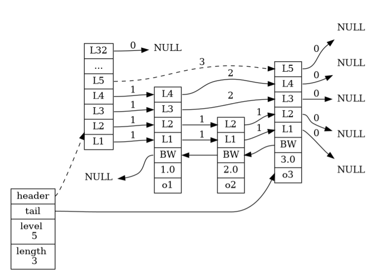

# 第一部分数据结构与对象

## 1、简单动态字符串SDS

- SDS应用在需要对字符串进行修改的地方，不采用c语言传统的字符串表示，SDS更加安全、效率高；C语言一般用于字符串常量，比如日志的打印
- SDS的定义
- 上图是一个SDS示例，其中free表示可利用的剩余空间，len表示此时已保存的字符串大小，buf属性是一个char类型的数组，里面包含具体的元素外，最后一个空间还保留着空字符串，**这点是为了SDS可以继续使用C语言字符串的其他库的功能**
- SDS的结构可以快速知道字符串的大小，而C语言需要进行遍历才能知道，redis里面查询字符长度的命令为STRLEN
- **杜绝缓冲区溢出**
  - 因为C语言无法知道字符串的大小，在进行字符串拼接的时候，如果插入字符串大小超过了已有的长度，将出现字符串溢出的情况
  - 而SDS的空间分配策略就很好地解决了缓冲溢出的情况，首先SDS会判断free是否能够放下字符串的大小，不够SDS会自动进行扩展，并最后为free赋值为和len一样的大小

- **减少修改字符串时带来的内存重分配次数策略**
  - 空间预分配（对字符串进行扩展）
    - 当SDS的长度大小小于1MB时，那么程序将为free分配和len一样的大小
    - 若SDS的长度大小大于1MB时，那么程序将为free分配1MB空间大小
    - 只有在free不够的时，才会对free执行以上的操作
    - 优点：可以减少连续执行字符串增长操作所需的内存重分配次数
  - 惰性空间释放（对字符串进行缩短）
    - 对于redis中对字符串进行缩短操作的时候，并不是立即对多出的长度进行释放，而是将多余的长度放在free里，防止下次再用到时，减少重复分配空间的操作
- **二进制安全**
  - C语言中的字符串是以空字符串为结束标志，因此不适合用于存储图片、视频这样的二进制文件
  - 而SDS并不是以空字符串为结束标志的，因此可以存储二进制文件，同时SDS的API也是安全的

## 2、**链表**

- 链表在增删的效率很高，在头尾节点的时间是O(1),

- 链表和链表节点的实现，被广泛用于实现redis的**列表键、发布与订阅、慢查询、监视器**等等，主要得益于使用场景，频繁用到链表的增删操作

- 

- 为一个双端链表结构，是一个无环结构，list记录了链表的长度、头、尾节点、以及其他特定的函数（可能包括一些匹配、赋值、释放等等）


## 3、字典（类似于java中的Map，k-v键值对）

- Redis的数据库底层就是字典

```cmake
redis > SET msg "hello world" // 其中msg就是键，后面就是vaule
```

- 也可用作哈希表的底层，当哈希键包含很多的键值，或则是键和值的字符串很长

- 字典的实现：底层是哈希表

  - 哈希表

    其中dictEntry结构保存着一个键值对，size属性记录了哈希表的大小，table就是这个哈希表数组，used表示目前已有节点，sizemask属性值总是等于size-1。

    

  - 哈希表节点，下面为dictEntry结构

  ```c
  typedef struct dictEntry {
  
      // 键
      void *key;
  
      // 值
      union {
          void *val;
          uint64_t u64;
          int64_t s64;
      } v;
  
      // 指向下个哈希表节点，形成链表，next可以将多个相同的键值对连接在一起
      struct dictEntry *next;
  
  } dictEntry;
  ```

  - 字典，下面为其结构

    ```c
    typedef struct dict {
    
        // 类型特定函数
        dictType *type;
    
        // 私有数据
        void *privdata;
    
        // 哈希表
        dictht ht[2];
    
        // rehash 索引
        // 当 rehash 不在进行时，值为 -1
        int rehashidx; /* rehashing not in progress if rehashidx == -1 */
    
    } dict;
    ```

    dictht中的第一个哈希表被字典使用，而第二个哈希表用来rehash时使用，而rehashidx就是来表示rehash的进度

    下图为一个没有rehash的字典

  - 哈希算法

    首先需要计算当前键的哈希值->哈希值和sizemark进行与运算->索引值，Redis会使用MurmurHash 算法进行更好的哈希值运算

- 解决键冲突

  - 当出现同一个索引值上时，哈希表使用链地址法来解决冲突，因为每个哈希表都有一个next指针，这样就可以将多个相同的索引值连接在一条链上，dictEntry没有指向尾节点的指针，因此为了速度考虑，每次添加新的元素，都会添加到最前面

- **rehash（重新分布散列）**

  - **存在的意义：为了解决当哈希表在增大和减少时，使其负载因子维持在一个稳定的范围**
  - 怎么做：
    - 1、如果是扩展，第二个哈希表的大小大于等于第一个哈希表ht[0].used * 2 + 2的n次方
    - 2、如果是收缩，第二个哈希表的大小大于等于第一个哈希表ht[0].used  + 2的n次方
    - 3、重新分配第一个表中的索引，然后放在第二个表中，释放第一个表，将第二个表改为第一个表

- 渐进式rehash

  - **存在的意义：当哈希表中存在成千上万个数据的时候，如果一次性rehash肯定会很慢，其中还存在着查找的功能，也会产生进程的影响**
  - 怎么做：
    - 1、其中字典里面的redisIndex来表示rehash的进度，0表示正在rehash，-1表示未开始
    - 2、进行rehash期间，如果有新添加的元素进来，直接添加到第二个表中；查找的时候，会先查找ht[0]，再去查找ht[1]，当rehash工作完成后，redisIndex变为-1

## 4、跳跃表

- **存在的意义：用于有序集合，当集合中元素数量比较多，又或者有序集合中元素的成员是比较长的字符串时；**

- **实际场景：1、实现有序集合键 2、 集群节点中用作内部数据结构**

- 实现： 

  - 首先它是由两个结构构成：zskiplistNode和zskiplist，其中zskiplistNode用于表示跳跃节点，zskiplist用于存储跳跃节点地信息，比如节点的表节点（header）、尾节点（tail）、长度（length）、最高层数（level），zskiplistNode包level（节点中l1、l2、l3表示），分值（score）、后退指针（backward）、成员对象（obj：这个必须是唯一的）

  - 这是跳跃节点的数据结构图

  - 前进指针：指向前面的，并且会带上跨度值（用于表示你到下一个跳跃节点对应层数的距离），可以一次跳多个节点比如下图中虚线，跨度为3

  - 跨度：用于表示两个节点之间的距离，两个节点之间的跨度越大，它们相距越大，指向null表示跨度为0，其中跨度是来实现rank（排名）

    

  - 后退指针：从表尾向表头访问节点，跟可以一次跳多个节点的不一样，只能指向前一个节点

  - 分值（score）：是一个浮点数，所有节点都按分值从小到大排列

  - 成员对象（obj）：是一个指针，指向一个字符串对象，这个对象保存是一个SDS值，每个对象是都是唯一的

  - `level` 属性则用于在 O(1) 复杂度内获取跳跃表中层高最大的那个节点的层数量， 注意表头节点的层高并不计算在内。


